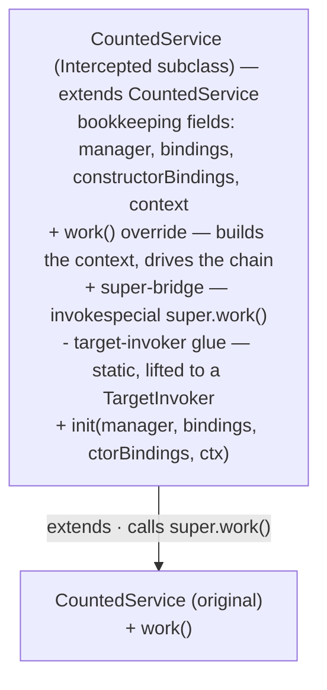
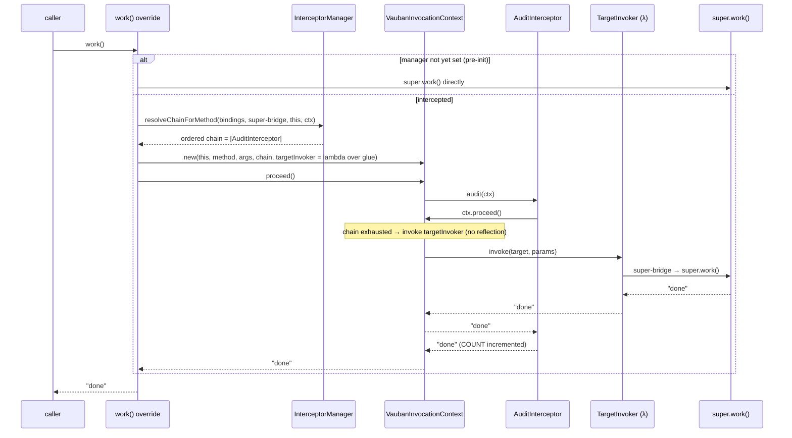
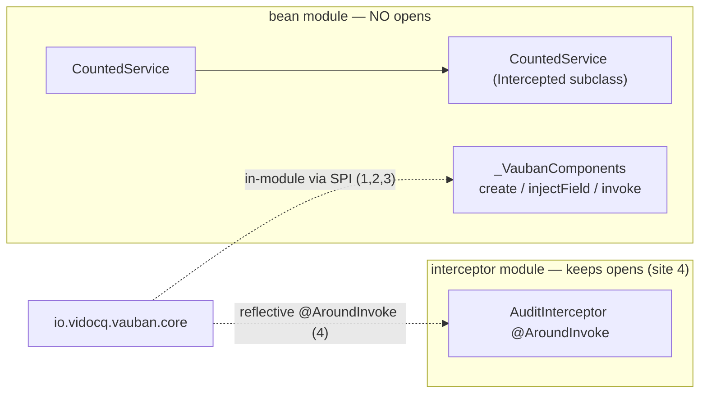
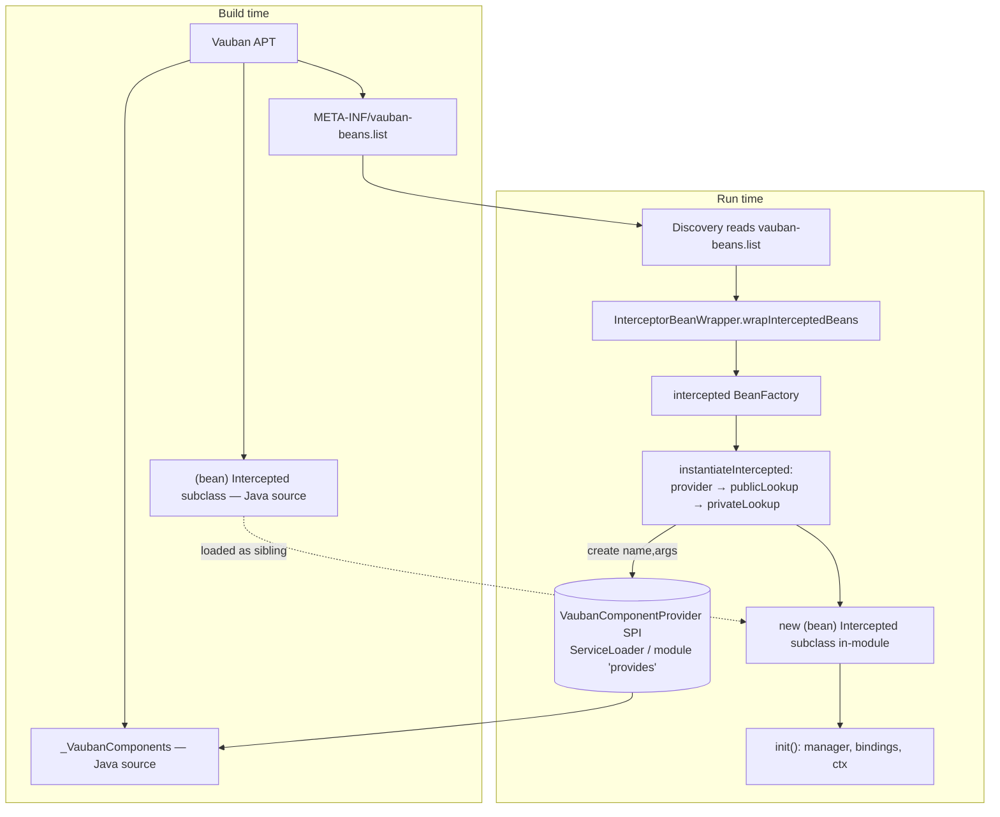

# How Vauban interception works — and why it is harder than it looks

> Short version: the APT **does** generate the proxy. Generating the class is the *easy* half.
> The hard half is that (a) the interceptor **chain is deployment-dynamic**, so it can only be
> resolved at run time, and (b) every run-time touch-point on the generated class — instantiating
> it, injecting it, invoking the original method — is a *reflective* operation that, on the strict
> module path, demands `opens … to io.vidocq.vauban.core`. Making all of that reflection-free
> (so an application module needs **no `opens`** and stays AOT-friendly) is what the
> F2 / F3 / B1 / B2 work was about.

---

## 1. What CDI interception actually requires

Given a managed bean and an interceptor binding:

```java
@InterceptorBinding                          // a custom binding…
@Retention(RUNTIME) @interface Audited {}

@Audited @Interceptor @Priority(APPLICATION) // …and an interceptor that observes it
class AuditInterceptor {
    static final AtomicInteger COUNT = new AtomicInteger();
    @AroundInvoke Object audit(InvocationContext ctx) throws Exception {
        COUNT.incrementAndGet();
        return ctx.proceed();                // <-- may be called 0..n times
    }
}

@Dependent
class CountedService {
    @Audited String work() { return "done"; }
}
```

When someone calls `countedService.work()`, the container must:

1. build an `InvocationContext` describing *this* call (method, args, contextData…);
2. run the **ordered chain** of matching interceptors — `audit(ctx)` here;
3. when an interceptor calls `ctx.proceed()` and the chain is exhausted, invoke the **real**
   `work()` body and return its value back up the chain.

Two properties of `@AroundInvoke` make this more than a wrapper:

- `ctx.proceed()` may be called **zero, once, or many times** (e.g. `@Retry` retries the body).
  So the target call is not a fixed "before/after" — it is a re-entrant protocol.
- the interceptor can **read and rewrite** the arguments, short-circuit, catch exceptions, etc.

---

## 2. The generated artifact: a `$$Intercepted` *subclass* (not a wrapping proxy)

Vauban generates `<bean>$$Intercepted extends <bean>` and **overrides every interceptable
method**. It is a *subclass*, not a delegating wrapper, on purpose:

| Need | Why a delegating proxy fails | Why the subclass works |
|------|------------------------------|------------------------|
| Call the original body | A wrapper holds a `delegate` and can only call `delegate.work()` — which would re-enter interception forever, or bypass it. | `super.work()` calls the original body exactly once, no recursion. |
| No interface required | A `java.lang.reflect.Proxy` needs an interface; CDI beans are usually concrete classes. | A subclass works for any non-final class. |
| `protected` / package-private methods, `this` identity, `final` fields | A foreign wrapper can't see them and breaks `this`. | The subclass *is-a* bean, so access and identity are preserved. |

The generated subclass contains, per interceptable method `work`:

- the **override** `work()` — builds the context and drives the chain;
- a **bridge** `public $$super$work()` — does `invokespecial super.work()` (the only way to reach the
  original body from inside the chain without re-triggering interception);
- a **glue** `private static $$ti$work(Object target, Object[] params)` — unboxes args and calls the
  bridge (see §6, B2);

plus shared members: fields `$$manager / $$bindings / $$constructorBindings / $$context`, and an
`$$init(...)` setter the container calls right after construction.

> In the diagrams below the generated `$$`-prefixed members are shown by role (the exact names
> `$$manager`, `$$super$work`, `$$ti$work`, `$$init`, `$$Intercepted` are kept in the prose) — a `$`
> in a mermaid label is parsed as a math delimiter by some renderers and breaks the diagram.



---

## 3. Why the chain is resolved at **run time**, not baked in by the APT

The generated override is **generic**: it does *not* hard-code "call AuditInterceptor". It only knows
the method *shape*. The actual ordered chain is computed at run time by
`InterceptorManager.resolveChainForMethod(bindings, method, …)`.

This is unavoidable, because **which interceptors apply is a property of the whole deployment, not of
the bean's compilation unit**:

- the bean's module is compiled **before** it is known which interceptor modules will be present;
- `@Priority` ordering is global across all enabled interceptors from every module;
- bindings can be **transitive** (`@A` meta-annotated `@B`) and can be **added at startup** by a
  Build-Compatible Extension (`@Enhancement`);
- the same `@Audited` method may be intercepted by 0, 1, or several interceptors depending on what is
  on the runtime module path.

So the APT can pre-generate the *structure* (which methods to override, the bridges) but **not the
binding → interceptor resolution**. That part is intrinsically late-bound. This is the first reason
"just generate a proxy at build time" is not the end of the story.

---

## 4. The end-to-end call (after all the wiring is in place)



---

## 5. The real difficulty: run-time touch-points vs. Java Modules `opens`

Generating `$$Intercepted` is done by the APT. But the container still has to **use** that class, and
each interaction is, naïvely, a reflective operation. On the strict module path,
`MethodHandles.privateLookupIn(...)` (Vauban's reflection choke-point) **throws unless the bean's
package is `opens`-ed to `io.vidocq.vauban.core`**:

```
IllegalAccessException: module <app> does not open <pkg> to module io.vidocq.vauban.core
```

The whole goal of the ecosystem is **zero `opens`** (and, ultimately, **zero reflection**, for
GraalVM/Leyden AOT). So every touch-point had to be made reflection-free. There are four of them on
the intercepted path:

| # | Touch-point | Naïve (needs `opens`) | Made reflection-free by |
|---|-------------|-----------------------|-------------------------|
| 1 | **Instantiate** `$$Intercepted` | `privateLookupIn(...).newInstance` | **F2**: `publicLookup` (public ctor in an exported pkg) → **B1**: in-module `new` via the generated `_VaubanComponents` provider |
| 2 | **Inject fields / run producers & lifecycle** on the bean | reflective `setField` / `method.invoke` | the generated `_VaubanComponents.injectField/invoke` does it in-module (`putfield` / `invokevirtual`) |
| 3 | **Invoke the original method** at chain end (`$$super$work`) | `makeAccessible` → `privateLookupIn` then `method.invoke` | **F3**: skip `privateLookupIn` for public members of exported packages → **B2**: a generated `TargetInvoker` lambda calls `$$super$work` directly |
| 4 | **Invoke the interceptor's `@AroundInvoke`** (`audit`) | `method.invoke` on the interceptor | *still reflective* — **F3** makes a **public** `@AroundInvoke` in an exported package `opens`-free (`VaubanLookup.makeAccessible` skips `privateLookupIn` for publicly invocable members); a **non-public** one still needs the **interceptor module's `opens`** (deferred "Étape 5") |

The key realisation: **the application/bean module can be made fully `opens`-free** (sites 1–3),
while the **interceptor module** may still have to open its own package for site 4 when its
`@AroundInvoke` is not public. That is why the proof vehicle separates them — the bean lives in a
module with **no `opens`**, the interceptor lives in a module that keeps one.



---

## 6. Build-time emission is all **source** (and that dissolves two old `javac` walls)

The APT emits **both** the `$$Intercepted` subclass and the per-package `_VaubanComponents` provider
as **readable Java source** (`Filer.createSourceFile`); javac compiles them in a later round. The
subclass the APT generates is exactly the source shown in §2 — the `super`-bridge, the static glue,
and a `<bean>$$Intercepted::$$ti$<name>` method reference that javac lowers to the *same*
`invokedynamic`/`LambdaMetafactory` the bytecode emitter hand-rolls (B2 comes for free). The only
source-specific subtlety is checked exceptions: `MethodShape` carries no `throws` clause and
`proceed()` is `throws Exception`, so the override catches every `Throwable` and re-throws the real
one through a generic-erasure `sneaky` helper (bytecode-faithful — the JVM never checks checked
exceptions — and identity-preserving).

Keeping everything source is not just cosmetic; it sidesteps two compiler limitations an earlier
bytecode-based design ran into:

**Wall A — a generated *source* cannot reference a generated *bytecode* sibling.**
If `$$Intercepted` were a class file (`Filer.createClassFile`) while `_VaubanComponents` is source, the
provider source could not resolve `new <bean>$$Intercepted(...)`:

```
error: cannot find symbol — class CountedService$$Intercepted
```

Emitting `$$Intercepted` as **source** removes this — javac resolves a generated-source sibling by
name across rounds.

**Wall B — `module-info` cannot reference a generated *bytecode* provider in the same compilation.**
`provides VaubanComponentProvider with …_VaubanComponents;` referencing a Filer-emitted class file
fails the same way, which previously forced a two-step `module-info` compile. With `_VaubanComponents`
emitted as **source**, a single `javac` pass resolves the `provides … with` clause against the
generated provider — no separate module-info step needed. (Proven on a two-module module-path
vehicle: the application module compiles in one pass and runs with **zero `opens`**.)

The bytecode `InterceptedEmitter` is still used — but only by the **runtime classpath fallback** and
the **Maven plugin** (which enrich beans *after* compilation, where javac can no longer emit source).
In those paths nothing generated references the subclass at compile time, so neither wall arises.

---

## 7. How the pieces fit at run time



- **`VaubanComponentProvider`** (in `vauban-api`) is the SPI: `create(String)`,
  `create(String, Object[])`, `injectField(...)`, `invoke(...)`. Each module contributes one
  `_VaubanComponents` implementation, registered via the module's `provides` clause (module path) or
  `META-INF/services` (class path).
- **`InterceptorBeanWrapper`** turns a discovered intercepted bean into a `BeanFactory` whose
  `create()` instantiates the `$$Intercepted`, then calls `$$init(...)` to hand it the
  `InterceptorManager` and bindings.
- **`instantiateIntercepted`** prefers the in-module provider (B1), falls back to `publicLookup` (F2),
  then to `privateLookupIn` (class path, or a non-exported package that still has an `opens`).

---

## 8. So — "why doesn't APT codegen alone make a proxy for the interceptor?"

It does generate the proxy (the `$$Intercepted` subclass). The misconception is that *generating the
class* is the whole job. It is not, for four compounding reasons:

1. **The interceptor is not known at build time.** The bean's APT run cannot bind `@Audited` to a
   concrete interceptor — `@Priority` ordering, transitive bindings, and BCE enhancements are
   deployment-global and late. So the generated class must defer chain resolution to run time. The
   APT emits *shape*, the runtime emits *policy*.
2. **It is a chain with a re-entrant `proceed()` protocol**, not a fixed before/after. The override
   has to materialise a full `InvocationContext` and let interceptors drive it.
3. **Reaching the original body requires `super`** — hence a subclass and a `$$super$` bridge, not a
   delegating wrapper.
4. **Wiring the generated class at run time is reflective**, and on the strict module path reflection
   needs `opens`. Eliminating those `opens` — without falling back to a runtime-defined class (which
   needs even deeper access) — required: in-module `new` via the generated `_VaubanComponents`
   provider for instantiation (B1, with `publicLookup` as an F2 fallback), and a generated
   `TargetInvoker` lambda for the target call (F3/B2). Emitting both the subclass and the provider as
   source keeps that wiring readable and dissolves the two `javac` walls (§6).

In other words: **APT generates the proxy; the difficulty is everything around it** — the dynamic
chain, the CDI `InvocationContext` protocol, the `super`-call mechanics, and (the bulk of the effort)
making the run-time wiring reflection- and `opens`-free so a plain application module can be
intercepted on the strict module path with nothing opened.

---

## 9. Current state and residuals

| Path | Reflection-free? | `opens`-free? | Mechanism |
|------|------------------|---------------|-----------|
| Instantiate `$$Intercepted` | ✅ (B1 in-module `new`) | ✅ | source `_VaubanComponents` |
| Field injection / producers / lifecycle | ✅ | ✅ | `_VaubanComponents.injectField/invoke` |
| Invoke original method (`$$super`) | ✅ (B2 lambda) | ✅ | `invokedynamic` + `LambdaMetafactory` |
| Resolve chain / `ctx.getMethod()` | ⚠️ `getDeclaredMethod` (metadata only) | ✅ | reflective lookup, no invoke — needs no `opens`; full removal would touch the CDI `getMethod()` contract |
| Interceptor `@AroundInvoke` (`audit`) | ❌ (still `method.invoke`) | ⚠️ public member in an exported package: ✅ (F3); non-public: ❌ (interceptor module keeps `opens`) | deferred "Étape 5" |
| Instantiate the interceptor itself | ✅ (VAU-INT-004: `@Interceptor` classes flow through `_VaubanComponents`) | ✅ | `instantiatePreferProvider`: in-module provider → `publicLookup` → reflection |

Net: an **application/bean module is fully `opens`-free and (on the intercepted path) reflection-free
for instantiation and target invocation**. The remaining reflection is (a) a metadata-only
`getDeclaredMethod` for the CDI contract, and (b) the interceptor's own `@AroundInvoke`, which keeps
its module's `opens` until Étape 5 unless the method is public.

---

## 10. Where an `opens` can still be needed on the module path — and what closes it

Everything above is about the **bean module**: what the container touches there is generated by the
APT into that module, so no `opens` is ever needed. The remaining question — the one raised in
[jakartaee/cdi#1015](https://github.com/jakartaee/cdi/issues/1015), *Using CDI alongside JPMS* — is
what happens when the proxied type is owned by **someone else**: a normal-scoped `@Produces`
returning a class from a module that knows nothing about CDI. This section is the up-to-date map of
those cases, as closed by vauban#42 (Stages 1–4, merged), and of what is still open. The
authoritative per-case reference is the Antora page
[Internals — client-proxy strategies](docs/en/modules/ROOT/pages/internals.adoc) and
[Vauban in Java SE](docs/en/modules/ROOT/pages/se.adoc); this section only ties them back to the
interception story.

### 10.1 The one rule that decides everything: *who defines the class*

Two facts, both from the JDK, shape every case:

- **`opens` governs reflective access across modules, nothing else.** `MethodHandles.privateLookupIn`
  is not a way *around* `opens`; it is the API that *consumes* it. Defining a class into another
  module's package through a `Lookup` therefore needs that module to open the package.
- **A class loader may define classes into any package it owns.** No `Lookup`, no `opens`: the
  loader that defined module *A* can define one more class into one of *A*'s packages. The JDK's
  application class loader offers no hook for this; a loader we control does.

So the question "can the proxy live in `Foo`'s package without `opens`?" has a precise answer:
**yes if a Vauban loader defines `Foo`'s module, no otherwise.** Everything else follows.

### 10.2 The cases, in the order the container tries them

| Produced type (normal-scoped `@Produces`) | Where the proxy is generated | Defined by | `opens`? |
|---|---|---|---|
| **Interface**, any module | build time, producer's package (`InterfaceProxySourceRenderer`, `implements`) | `javac` | none |
| **Fully public class** — public, non-final, non-sealed, non-abstract; a public or protected ctor; *only public* non-final virtuals, checked over the whole superclass chain | build time, producer's package (`ClientProxySourceRenderer.renderAt`, `extends it.liba.Foo`) | `javac` | none |
| **Class needing its own package** — a package-private or `protected` overridable member, declared or inherited, or no accessible ctor — **and the library is defined by a Vauban loader** (`Launch`, `Vidocq.run`) | build time, as bytecode shipped in the bean archive (`META-INF/vauban/placed/<pkg>/<Type>_ClientProxy.class` + `META-INF/vauban/required-opens.list`) | `VaubanClassLoader` *places* it into `Foo`'s package on a `findClass` miss | none (the package must still be `exports`-ed: `io.vidocq.vauban.core` instantiates the proxy) |
| **Same shapes, bare boot layer** (no launcher, or a module the launcher *keeps*) | runtime, `RuntimeClientProxyGenerator` into `Foo`'s package | `privateLookupIn(Foo).defineClass` | **required** — the container refuses by default and names the remedies |
| **Unproxyable outright** (CDI 4.1 §3.10: `final`/`sealed` class, non-private `final` virtual, abstract) | nowhere | — | deployment error, as the spec requires |

Two opt-in levers remain for the fourth row, both deliberately *not* defaults:

- `-Dvauban.opens.auto=true` — `OpensApplier` reads `required-opens.list` at boot and calls
  `Instrumentation.redefineModule` through the weaving agent to open the package. Off by default:
  opening someone else's package behind the user's back is precisely what this project faults
  runtime CDI implementations for needing, and it acquires a dependency on dynamic agent attachment
  that integrity by default is closing.
- `vauban:enhance-dependencies` — rewrites a *copy* of the dependency jar with the co-located proxy
  and a `provides` in its `module-info.class`; the copy drops the original's signature and declares
  its origin in the manifest. Opt-in because it is a modified redistribution of someone else's
  artefact, not because of a technical limit. It is also the only path for a GraalVM native image,
  where a placed class (defined at run time) is not available.

Non-eligible producers are surfaced **at build time** (`-Avauban.producerProxy=error|warn|note`,
default `note`) with the reason and the ways to stay `opens`-free, instead of an
`IllegalAccessException` at first resolution.

### 10.3 What this changes for the four residues listed on 2026-09-09

| Residue (as first listed) | Status on `main` |
|---|---|
| Producer of a **class** from a CDI-agnostic module | **Closed** for fully-public types (build-time, producer's package) and for the in-package shapes **under a Vauban loader** (placement). Open only on a bare boot layer, where the container refuses with an actionable message rather than opening anything itself. |
| `protected`/package-private virtuals **inherited from another package** | **Closed for placed proxies**: a `protected` member inherited from a superclass in another package is forwarded through a `MethodHandle` resolved from *inside* `Foo`'s module (`privateLookupIn(Foo, lookup())` where `lookup()` is the placed proxy itself — same module, so no `opens`). A **package-private** member inherited from a superclass in another package is *not* forwardable by any proxy anywhere (no class outside that runtime package can override it) and is left out by design. |
| Non-public `@AroundInvoke` (site 4) | **Unchanged** — an explicit scope cut of vauban#42. `VaubanLookup.makeAccessible` skips `privateLookupIn` for a public member of a public class in an exported package (F3); a package-private `@AroundInvoke` still goes through it, so the **interceptor module keeps its `opens`**. The `Invoker` refactor (CDI 4.1 `Invoker`, MethodHandle-first with reflective fallback) does not touch this site. |
| Jars not compiled with the APT | **Closed** by `vauban:generate` for scanned jars (bytecode parity with the APT, #42 Stage 1.6) and by placement/`enhance-dependencies` for the in-package shapes; the class path keeps its reflective fallback, and the container says so at boot. |

### 10.4 Two things worth knowing before quoting "zero opens" outside

- **The headline is "no reflective access that needs an `opens`", not "zero reflection".** The
  2026-09-13 reflection audit ([internals.adoc#aot](docs/en/modules/ROOT/pages/internals.adoc))
  lists what still reflects: `Class.forName` on the index names (no `opens` needed, but opaque to an
  AOT compiler), the annotation *instances* handed to application code (`java.lang.reflect.Proxy`
  over index data) and the members of *live* annotations the index does not describe
  (`Method.invoke`, off the resolution path, gated by `-Dvauban.annotations.reflection`), and the
  class-path fallbacks. Qualifier and binding *matching* itself no longer reflects since vauban#70
  (2026-09-14): it compares `AnnotationKey`s built from the index. A GraalVM native image needs
  reflection metadata for what remains, and Vauban does not generate it. CDS/Leyden and `jlink` are
  unaffected (the Vauban layer re-layers from a runtime image too).
- **Managed beans: inherited non-public virtuals are not forwarded by the APT source proxy.**
  `ClientProxyShapeFromElements.from` forwards a bean's *declared* non-private virtuals and its
  *inherited public* ones only; an inherited `protected` or package-private method — even from a
  superclass in the same package or the same module, where a plain call or an in-module
  `MethodHandle` would compile with no `opens` — is skipped, so invoking it on the proxy runs the
  superclass body against the proxy's own default-initialised state. `fromColocated` (the placed
  shape) does not have this cut. This is a correctness gap independent of Java Modules; it is not
  yet tracked in `BUG.md` and should be.

### 10.5 Reading for the spec discussion

- Where the proxy lands is a **class-loader question at least as much as a module one**. An
  implementation that controls the defining loader of the application modules — as EE servers do —
  can honour §3.10's implicit same-package rule (a non-final method of *default visibility* must be
  proxyable) without any `opens`. The SE case is hard mostly because the boot layer's loader is not
  ours; that is what the launcher changes.
- Build-time generation removes the `opens` for everything the **bean module owns**, and — via
  placement or relocation to the producer's package — for most of what it *borrows*. What it cannot
  remove is the `opens` for an in-package proxy on a bare boot layer; there the honest choices are a
  deployment-time error with an actionable message, or an explicit, user-visible opt-in.
- A future CDI Full profile (Portable Extensions, `InterceptionFactory`) makes runtime class
  definition unavoidable; a loader-based placement is agnostic to *when* the bytes were produced,
  which is why it is the mechanism we favour over agent-applied `opens`.
