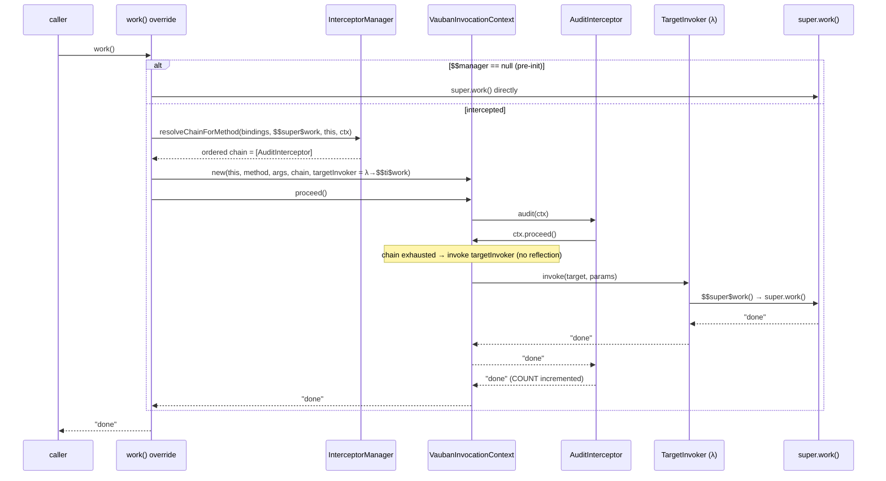
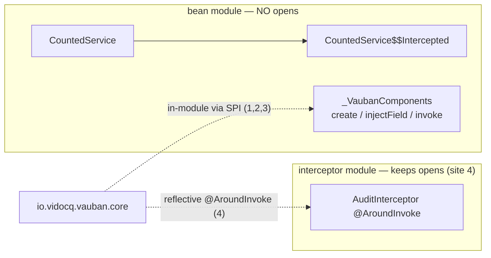
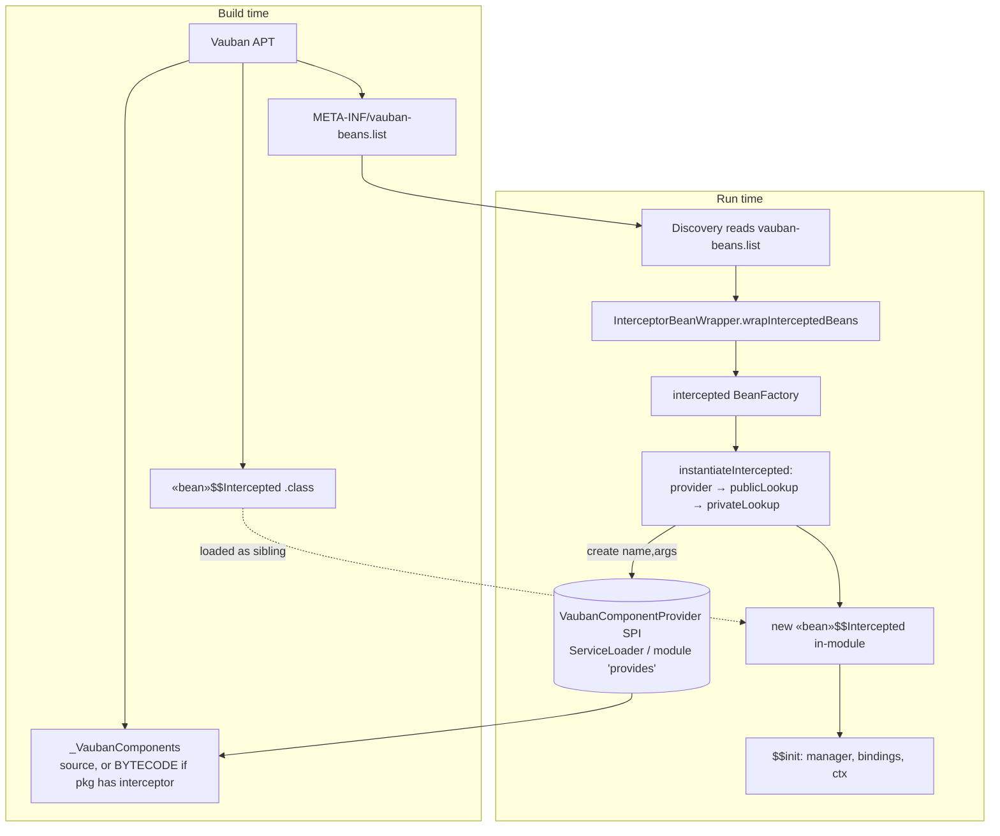

# How Vauban interception works — and why it is harder than it looks

> Short version: the APT **does** generate the proxy. Generating the class is the *easy* half.
> The hard half is that (a) the interceptor **chain is deployment-dynamic**, so it can only be
> resolved at run time, and (b) every run-time touch-point on the generated class — instantiating
> it, injecting it, invoking the original method — is a *reflective* operation that, on the strict
> module path, demands `opens … to io.vidocq.vauban.core`. Making all of that reflection-free
> (so an application module needs **no `opens`** and stays AOT-friendly) is what the
> F2 / F3 / B1 / B2 work was about.

---

## 1. What CDI interception actually requires

Given a managed bean and an interceptor binding:

```java
@InterceptorBinding                          // a custom binding…
@Retention(RUNTIME) @interface Audited {}

@Audited @Interceptor @Priority(APPLICATION) // …and an interceptor that observes it
class AuditInterceptor {
    static final AtomicInteger COUNT = new AtomicInteger();
    @AroundInvoke Object audit(InvocationContext ctx) throws Exception {
        COUNT.incrementAndGet();
        return ctx.proceed();                // <-- may be called 0..n times
    }
}

@Dependent
class CountedService {
    @Audited String work() { return "done"; }
}
```

When someone calls `countedService.work()`, the container must:

1. build an `InvocationContext` describing *this* call (method, args, contextData…);
2. run the **ordered chain** of matching interceptors — `audit(ctx)` here;
3. when an interceptor calls `ctx.proceed()` and the chain is exhausted, invoke the **real**
   `work()` body and return its value back up the chain.

Two properties of `@AroundInvoke` make this more than a wrapper:

- `ctx.proceed()` may be called **zero, once, or many times** (e.g. `@Retry` retries the body).
  So the target call is not a fixed "before/after" — it is a re-entrant protocol.
- the interceptor can **read and rewrite** the arguments, short-circuit, catch exceptions, etc.

---

## 2. The generated artifact: a `$$Intercepted` *subclass* (not a wrapping proxy)

Vauban generates `<bean>$$Intercepted extends <bean>` and **overrides every interceptable
method**. It is a *subclass*, not a delegating wrapper, on purpose:

| Need | Why a delegating proxy fails | Why the subclass works |
|------|------------------------------|------------------------|
| Call the original body | A wrapper holds a `delegate` and can only call `delegate.work()` — which would re-enter interception forever, or bypass it. | `super.work()` calls the original body exactly once, no recursion. |
| No interface required | A `java.lang.reflect.Proxy` needs an interface; CDI beans are usually concrete classes. | A subclass works for any non-final class. |
| `protected` / package-private methods, `this` identity, `final` fields | A foreign wrapper can't see them and breaks `this`. | The subclass *is-a* bean, so access and identity are preserved. |

The generated subclass contains, per interceptable method `work`:

- the **override** `work()` — builds the context and drives the chain;
- a **bridge** `public $$super$work()` — does `invokespecial super.work()` (the only way to reach the
  original body from inside the chain without re-triggering interception);
- a **glue** `private static $$ti$work(Object target, Object[] params)` — unboxes args and calls the
  bridge (see §6, B2);

plus shared members: fields `$$manager / $$bindings / $$constructorBindings / $$context`, and an
`$$init(...)` setter the container calls right after construction.

```mermaid
classDiagram
    class CountedService {
        +work() String
    }
    class CountedService$$Intercepted {
        -$$manager : InterceptorManager
        -$$bindings : Set
        +work() String  «override»
        +$$super$work() String  «invokespecial super.work»
        -$$ti$work(Object, Object[]) Object  «static glue»
        +$$init(manager, bindings, ctorBindings, ctx)
    }
    CountedService <|-- CountedService$$Intercepted : extends
```

---

## 3. Why the chain is resolved at **run time**, not baked in by the APT

The generated override is **generic**: it does *not* hard-code "call AuditInterceptor". It only knows
the method *shape*. The actual ordered chain is computed at run time by
`InterceptorManager.resolveChainForMethod(bindings, method, …)`.

This is unavoidable, because **which interceptors apply is a property of the whole deployment, not of
the bean's compilation unit**:

- the bean's module is compiled **before** it is known which interceptor modules will be present;
- `@Priority` ordering is global across all enabled interceptors from every module;
- bindings can be **transitive** (`@A` meta-annotated `@B`) and can be **added at startup** by a
  Build-Compatible Extension (`@Enhancement`);
- the same `@Audited` method may be intercepted by 0, 1, or several interceptors depending on what is
  on the runtime module path.

So the APT can pre-generate the *structure* (which methods to override, the bridges) but **not the
binding → interceptor resolution**. That part is intrinsically late-bound. This is the first reason
"just generate a proxy at build time" is not the end of the story.

---

## 4. The end-to-end call (after all the wiring is in place)



---

## 5. The real difficulty: run-time touch-points vs. JPMS `opens`

Generating `$$Intercepted` is done by the APT. But the container still has to **use** that class, and
each interaction is, naïvely, a reflective operation. On the strict module path,
`MethodHandles.privateLookupIn(...)` (Vauban's reflection choke-point) **throws unless the bean's
package is `opens`-ed to `io.vidocq.vauban.core`**:

```
IllegalAccessException: module <app> does not open <pkg> to module io.vidocq.vauban.core
```

The whole goal of the ecosystem is **zero `opens`** (and, ultimately, **zero reflection**, for
GraalVM/Leyden AOT). So every touch-point had to be made reflection-free. There are four of them on
the intercepted path:

| # | Touch-point | Naïve (needs `opens`) | Made reflection-free by |
|---|-------------|-----------------------|-------------------------|
| 1 | **Instantiate** `$$Intercepted` | `privateLookupIn(...).newInstance` | **F2**: `publicLookup` (public ctor in an exported pkg) → **B1**: in-module `new` via the generated `_VaubanComponents` provider |
| 2 | **Inject fields / run producers & lifecycle** on the bean | reflective `setField` / `method.invoke` | the generated `_VaubanComponents.injectField/invoke` does it in-module (`putfield` / `invokevirtual`) |
| 3 | **Invoke the original method** at chain end (`$$super$work`) | `makeAccessible` → `privateLookupIn` then `method.invoke` | **F3**: skip `privateLookupIn` for public members of exported packages → **B2**: a generated `TargetInvoker` lambda calls `$$super$work` directly |
| 4 | **Invoke the interceptor's `@AroundInvoke`** (`audit`) | `method.invoke` on the interceptor | *still reflective* — the **interceptor module keeps its `opens`** (deferred "Étape 5") |

The key realisation: **the application/bean module can be made fully `opens`-free** (sites 1–3),
while the **interceptor module** still opens its own package for site 4. That is why the proof
vehicle separates them — the bean lives in a module with **no `opens`**, the interceptor lives in a
module that keeps one.



---

## 6. The two `javac` walls (why the provider is emitted as **bytecode**, and the two-step module-info)

The "clean" way to do site 1 is to let the bean's own `_VaubanComponents` run
`new <bean>$$Intercepted(args)` — fully in-module, zero reflection. But two compiler limitations got
in the way:

**Wall A — generated *source* cannot reference generated *bytecode*.**
The APT writes `$$Intercepted` as a **class file** via `Filer.createClassFile`, but writes
`_VaubanComponents` as **Java source**. A generated source compiled in a later round cannot resolve a
sibling that exists only as a Filer-emitted class file:

```
error: cannot find symbol — class CountedService$$Intercepted
```

Fix (**B1**): for packages that contain an intercepted bean, emit `_VaubanComponents` as **bytecode**
(Class-File API) instead of source. Bytecode references a class by its **binary name**, resolved by
the JVM at *run* time, not by `javac` at *compile* time. (Readable source is kept for every other
package.) The bytecode generator already existed for the Maven plugin; B1 gave it parity
(`create(String, Object[])`) and pointed the APT at it.

**Wall B — `module-info` cannot reference the generated bytecode provider in the same compilation.**
`provides VaubanComponentProvider with …_VaubanComponents;` references a class that, again, only
exists as a Filer-emitted class file. Compiling `module-info.java` in the same pass fails the same
way. This is why every Vauban module compiles its `module-info` in a **separate step**
(`prepare-package`, after `target/classes` already contains the generated `.class`). The hand-rolled
proof vehicle had to reproduce that two-step (`javac --patch-module … module-info.java`).

---

## 7. How the pieces fit at run time



- **`VaubanComponentProvider`** (in `vauban-api`) is the SPI: `create(String)`,
  `create(String, Object[])`, `injectField(...)`, `invoke(...)`. Each module contributes one
  `_VaubanComponents` implementation, registered via the module's `provides` clause (module path) or
  `META-INF/services` (class path).
- **`InterceptorBeanWrapper`** turns a discovered intercepted bean into a `BeanFactory` whose
  `create()` instantiates the `$$Intercepted`, then calls `$$init(...)` to hand it the
  `InterceptorManager` and bindings.
- **`instantiateIntercepted`** prefers the in-module provider (B1), falls back to `publicLookup` (F2),
  then to `privateLookupIn` (class path, or a non-exported package that still has an `opens`).

---

## 8. So — "why doesn't APT codegen alone make a proxy for the interceptor?"

It does generate the proxy (the `$$Intercepted` subclass). The misconception is that *generating the
class* is the whole job. It is not, for four compounding reasons:

1. **The interceptor is not known at build time.** The bean's APT run cannot bind `@Audited` to a
   concrete interceptor — `@Priority` ordering, transitive bindings, and BCE enhancements are
   deployment-global and late. So the generated class must defer chain resolution to run time. The
   APT emits *shape*, the runtime emits *policy*.
2. **It is a chain with a re-entrant `proceed()` protocol**, not a fixed before/after. The override
   has to materialise a full `InvocationContext` and let interceptors drive it.
3. **Reaching the original body requires `super`** — hence a subclass and a `$$super$` bridge, not a
   delegating wrapper.
4. **Wiring the generated class at run time is reflective**, and on the strict module path reflection
   needs `opens`. Eliminating those `opens` — without falling back to a runtime-defined class (which
   needs even deeper access) — required: emitting the provider as bytecode (Wall A), the two-step
   module-info (Wall B), `publicLookup`/in-module `new` for instantiation (F2/B1), and a generated
   `TargetInvoker` lambda for the target call (F3/B2).

In other words: **APT generates the proxy; the difficulty is everything around it** — the dynamic
chain, the CDI `InvocationContext` protocol, the `super`-call mechanics, and (the bulk of the effort)
making the run-time wiring reflection- and `opens`-free so a plain application module can be
intercepted on the strict module path with nothing opened.

---

## 9. Current state and residuals

| Path | Reflection-free? | `opens`-free? | Mechanism |
|------|------------------|---------------|-----------|
| Instantiate `$$Intercepted` | ✅ (B1 in-module `new`) | ✅ | bytecode `_VaubanComponents` |
| Field injection / producers / lifecycle | ✅ | ✅ | `_VaubanComponents.injectField/invoke` |
| Invoke original method (`$$super`) | ✅ (B2 lambda) | ✅ | `invokedynamic` + `LambdaMetafactory` |
| Resolve chain / `ctx.getMethod()` | ⚠️ `getDeclaredMethod` (metadata only) | ✅ | reflective lookup, no invoke — needs no `opens`; full removal would touch the CDI `getMethod()` contract |
| Interceptor `@AroundInvoke` (`audit`) | ❌ (still `method.invoke`) | ❌ (interceptor module keeps `opens`) | deferred "Étape 5" |

Net: an **application/bean module is fully `opens`-free and (on the intercepted path) reflection-free
for instantiation and target invocation**. The remaining reflection is (a) a metadata-only
`getDeclaredMethod` for the CDI contract, and (b) the interceptor's own `@AroundInvoke`, which keeps
its module's `opens` until Étape 5.
