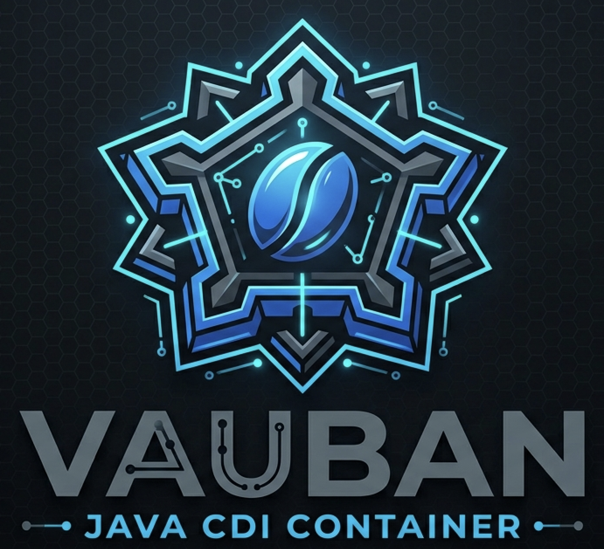
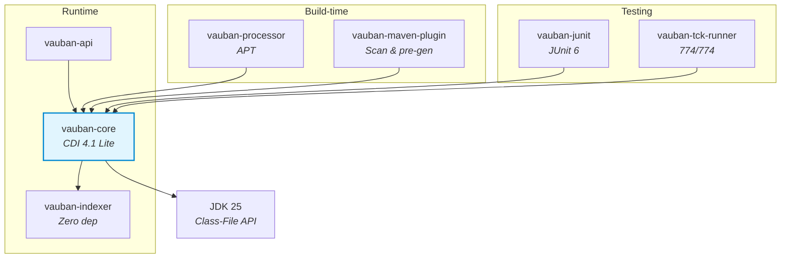

<p align="center">
  
</p>

<h1 align="center">Vauban</h1>

<p align="center">
  <strong>Conteneur CDI 4.1 natif Java Modules :)</strong><br>
  <a href="https://jakarta.ee/specifications/cdi/4.1/">CDI 4.1</a> | JDK 25 | JPMS | Virtual Threads | Zero reflexion
</p>

<p align="center">
  
  
  
  
  
</p>

---

> [English version below](#english)

## Qu'est-ce que Vauban ?

Vauban est une implementation de [Jakarta CDI 4.1](https://jakarta.ee/specifications/cdi/4.1/) concue des le depart pour le systeme de modules Java (JPMS). Il genere tout le code necessaire (factories, proxies, intercepteurs) a la compilation via l'API Class-File du JDK 25, sans aucune dependance bytecode externe.

### Pourquoi Vauban ?

| | Weld | ArC (Quarkus) | **Vauban** |
|---|---|---|---|
| Approche | Runtime / reflexion | Build-time / Jandex + ASM | **Build-time / Class-File API** |
| JPMS | Non | Non | **Natif** |
| Dependances bytecode | ASM / ByteBuddy | ASM | **Aucune** (JDK pur) |
| CDI Lite TCK | ~100% | ~100% | **100% (774/774)** |

### Philosophie

- **JPMS-first** : chaque composant est un module Java explicite (`module-info.java`)
- **Zero reflexion** : generation de code statique via l'API Class-File du JDK 25
- **Virtual threads ready** : `ScopedValue` (JEP 487) au lieu de `ThreadLocal` partout
- **Dependances minimales** : l'indexeur n'a aucune dependance externe
- **Build Compatible Extensions** : modele d'extensions CDI 4.1 Lite

## Demarrage rapide

### Prerequis

- JDK 25 (Temurin)
- Maven 4.0.0-rc-5

```bash
# Avec SDKMAN!
sdk env install
```

### Build

```bash
mvn clean verify
```

### Trois facons de declarer les beans

| Mode | Quand l'utiliser | API |
|------|-----------------|-----|
| **`scanLocal()`** | Application standard | Scanne le package de l'appelant + sous-packages |
| **`scanPackage()` + `scanClasspath()`** | Multi-modules, dependances CDI | Scan explicite + beans des JARs (via `vauban-maven-plugin`) |
| **`addBeanClass()`** | Tests unitaires | Chaque bean est liste a la main — perimetre chirurgical |

### Application standard (`scanLocal`)

```java
import io.vidocq.vauban.core.container.VaubanContainer;

// Scanne automatiquement le package de l'appelant (com.example.**)
var container = VaubanContainer.builder()
    .scanLocal()
    .build();

var service = container.select(MonService.class);
service.traiter(42);
container.close();
```

### Multi-modules avec dependances CDI (`scanClasspath`)

Les beans dans les JARs de dependances sont decouverts au build par `vauban-maven-plugin`
et listes dans `META-INF/vauban-beans.list`. Au runtime, `scanClasspath()` les charge.

```xml
<!-- pom.xml -->
<plugin>
  <groupId>io.vidocq.vauban</groupId>
  <artifactId>vauban-maven-plugin</artifactId>
  <executions>
    <execution>
      <goals><goal>generate</goal></goals>
    </execution>
  </executions>
</plugin>
```

```java
var container = VaubanContainer.builder()
    .scanClasspath()                    // beans des dependances (JARs)
    .scanPackage("com.example.app")     // beans locaux
    .build();
```

> Le plugin `vauban:generate` pre-genere aussi les client proxies (`_ClientProxy`)
> et les sous-classes interceptees (`$$Intercepted`) avec un nommage deterministe.
> Au runtime, ces classes sont trouvees sur le classpath sans regeneration.

### Tests unitaires (`addBeanClass`)

Perimetre controle — pas de scan implicite, pas de bean inattendu :

```java
var container = VaubanContainer.builder()
    .addBeanClass(MonService.class)
    .addBeanClass(MonRepository.class)
    .build();
```

### Beans CDI

```java
@ApplicationScoped
public class MonService {

    @Inject
    MonRepository repository;

    public String traiter(int id) {
        return repository.trouver(id).nom();
    }
}

@Dependent
public class MonRepository {
    public Record trouver(int id) {
        return new Record(id, "Item " + id);
    }

    public record Record(int id, String nom) {}
}
```

### Tests avec JUnit 6

`@AddBeans` declare explicitement les classes a inclure dans le conteneur de test.
Perimetre controle — pas de scan implicite, pas de bean inattendu.

```java
@VaubanTest
@AddBeans({MonService.class, MonRepository.class})
class MonServiceTest {

    @Inject
    MonService service;

    @Test
    void devraitTraiterCorrectement() {
        assertNotNull(service.traiter(1));
    }
}
```

### Evenements CDI

```java
@ApplicationScoped
public class NotificationService {

    @Inject
    Event<Commande> commandeEvent;

    public void passer(Commande cmd) {
        commandeEvent.fire(cmd);
    }
}

@ApplicationScoped
public class AuditService {

    void onCommande(@Observes Commande cmd) {
        System.out.println("Commande recue: " + cmd);
    }
}
```

### Intercepteurs

```java
@InterceptorBinding
@Target({TYPE, METHOD})
@Retention(RUNTIME)
public @interface Logged {}

@Logged @Interceptor @Priority(1000)
public class LogInterceptor {

    @AroundInvoke
    public Object log(InvocationContext ctx) throws Exception {
        System.out.println(">> " + ctx.getMethod().getName());
        return ctx.proceed();
    }
}

@ApplicationScoped
@Logged
public class MonService {
    public String traiter(int id) { return "OK"; }
}
```

---

## Architecture

> Documentation detaillee avec diagrammes Mermaid : [docs/architecture.md](docs/architecture.md)



```
vauban/
├── vauban-indexer            Indexeur de bytecode (remplace Jandex), zero dependance
├── vauban-api                API publique Vauban
├── vauban-core               Runtime du conteneur CDI 4.1 Lite
├── vauban-processor          Processeur d'annotations (compile-time)
├── vauban-maven-plugin       Plugin Maven : scan, generation, chiffrement, distribution
├── vauban-classloader-spi    SPI pour plugins de chargement de classes (extensible)
├── vauban-sjar               Chiffrement in-JAR AES-256-GCM (implementation du SPI)
├── vauban-junit              Extension JUnit 6 pour tests CDI
├── vauban-tck-runner         Runner CDI TCK 4.1 (774/774)
├── vauban-test-suite         Suite de tests d'integration
└── vauban-examples           Exemples multi-modules (plain + chiffre + distribution)
```

---

## Modules

### vauban-indexer

**Role** : Scanner et indexer les fichiers `.class` sans reflexion ni dependances externes.

Equivalent fonctionnel de Jandex, mais utilise exclusivement l'API Class-File du JDK 25.
Produit un `VaubanIndex` immutable contenant les metadonnees de toutes les classes scannees.

| Classe | Role |
|--------|------|
| `ClassFileScanner` | Parse un fichier `.class` JDK 25 en `ClassInfo` |
| `JarScanner` | Scanne un JAR complet |
| `IndexBuilder` | Construit un index incrementalement |
| `VaubanIndex` | Index immutable — requetes par nom, annotation, supertype |
| `ClassInfo` | Metadonnees d'une classe (annotations, champs, methodes, supertypes) |
| `TypeInfo` | Representation des types (class, parameterized, wildcard, type variable, array) |
| `DotName` | Nom qualifie interne (`jakarta.inject.Inject`) |

**Module JPMS** : `io.vidocq.vauban.indexer` — zero dependance externe.

```java
var index = new IndexBuilder()
    .scan(MyService.class)
    .scan(MyRepository.class)
    .build();

var beans = index.getAnnotatedClasses(DotName.of("jakarta.enterprise.context.ApplicationScoped"));
```

### vauban-api

**Role** : Point d'entree public pour les applications.

Fournit la facade `Vauban` et re-exporte les contrats CDI 4.1.

**Module JPMS** : `io.vidocq.vauban.api` — depend de Jakarta CDI API (transitif).

### vauban-core

**Role** : Le coeur du conteneur CDI. Gere le cycle de vie des beans, l'injection, les scopes, les evenements, les intercepteurs et les Build Compatible Extensions.

#### Packages et classes cles

| Package | Classes cles | Role |
|---------|-------------|------|
| `container` | `VaubanContainer`, `VaubanBeanManager`, `ManagedBean`, `InstanceImpl` | Bootstrap, gestion des beans, cycle de vie |
| `bean.discovery` | `BeanDiscovery` | Decouverte CDI via l'index |
| `bean.model` | `BeanDescriptor`, `InterceptorDescriptor`, `ObserverDescriptor` | Modeles de metadonnees |
| `bean.resolution` | `BeanResolver`, `QualifierMatcher` | Resolution des beans par type + qualifiers |
| `bean.validation` | `ClassValidator`, `DeploymentValidator` | Validation DefinitionException / DeploymentException |
| `context` | `ApplicationContext`, `RequestContext`, `DependentContext` | Implementations des scopes |
| `event` | `EventDispatcher`, `EventImpl`, `VaubanObserverMethod` | Fire sync/async, matching des observeurs |
| `interceptor` | `InterceptorManager`, `VaubanInvocationContext`, `InterceptorSubclassGenerator` | Resolution, chaines, generation de sous-classes `$$Intercepted` |
| `extensions` | `BceProcessor`, `VaubanBuildServices` | Build Compatible Extensions (phases Discovery → Validation) |
| `langmodel` | `VaubanClassInfo`, `VaubanAnnotationMember` | CDI Language Model (`jakarta.enterprise.lang.model`) |
| `types` | `AssignabilityRules`, `TypeHierarchyResolver` | Regles d'assignabilite CDI 4.1 Section 2.4 |
| `proxy` | `RuntimeClientProxyGenerator` | Generation de client proxies via Class-File API |

#### Sequence de demarrage (`VaubanContainer.builder().build()`)

```
1. Collecte des classes beans (classpath ou programmatique)
2. BeanDiscovery : scan de l'index, decouverte annotated-mode
   ├── Beans manages (scopes, stereotypes)
   ├── Producers (@Produces methodes/champs)
   ├── Observeurs (@Observes / @ObservesAsync)
   └── Intercepteurs (@Interceptor + @InterceptorBinding)
3. ClassValidator : validation DefinitionException
4. BceProcessor : Build Compatible Extensions
   ├── @Discovery → @Enhancement → @Registration → @Synthesis → @Validation
   └── Beans/observeurs synthetiques
5. DeploymentValidator : validation DeploymentException
6. Creation des scopes (ApplicationContext, RequestContext, DependentContext)
7. InterceptorManager : resolution des chaines d'intercepteurs
8. EventDispatcher : enregistrement des observeurs
9. VaubanBeanManager : facade BeanManager CDI
10. Fire @Initialized(ApplicationScoped.class) et @Startup
```

#### Injection

Le `BeanResolver` resout les points d'injection par type + qualifiers :
- Supporte `@Inject` sur champs, constructeurs et methodes
- Qualifiers : `@Named`, `@Default`, `@Any`, qualifiers custom
- `@Typed` pour restreindre les types exposes
- `Instance<T>` pour le lookup programmatique
- `InjectionPoint` pour la metadata d'injection

#### Evenements

`EventDispatcher` gere le fire synchrone et asynchrone :
- Matching par type d'evenement (incluant les generiques) et qualifiers
- Tri par `@Priority` des observeurs
- Support `@Observes(during = IF_EXISTS)` conditionnel
- `fireAsync()` retourne `CompletionStage<U>`
- `EventMetadata` avec type runtime resolu

#### Intercepteurs

Generes via l'API Class-File — zero reflexion a l'execution :
- Sous-classe `BeanClass$$Intercepted` avec methodes overridees
- Bridge `$$super$methodName` pour l'appel a la methode originale
- `@AroundInvoke` et `@AroundConstruct`
- Matching des bindings par nom + valeurs membres
- Support des bindings herites et transitifs (via stereotypes)

**Module JPMS** : `io.vidocq.vauban.core` — fournit `CDIProvider` et `BuildServices`.

### vauban-processor

**Role** : Processeur d'annotations (APT) qui genere les factories de beans et les client proxies a la compilation.

| Classe | Role |
|--------|------|
| `VaubanProcessor` | Point d'entree APT (`AbstractProcessor`) |
| `ElementScanner` | Convertit les elements APT en `ClassInfo` |
| `BeanFactoryGenerator` | Genere les implementations `BeanFactory<T>` |
| `ClientProxyGenerator` | Genere les client proxies pour les scopes normaux |

**Flux** :
1. APT detecte les annotations CDI
2. Scan des elements → `VaubanIndex`
3. `BeanDiscovery` + `DeploymentValidator`
4. Generation bytecode via Class-File API pour chaque bean manage

**Module JPMS** : `io.vidocq.vauban.processor` — depend de `java.compiler`.

### vauban-junit

**Role** : Integration JUnit 6 (Jupiter) pour les tests CDI.

| Classe | Role |
|--------|------|
| `VaubanExtension` | Extension JUnit (`BeforeAllCallback`, `AfterAllCallback`, `TestInstancePostProcessor`) |
| `@VaubanTest` | Marque une classe de test pour CDI |
| `@AddBeans` | Declare les classes beans a inclure dans le conteneur de test |

**Fonctionnement** :
1. `@BeforeAll` : cree un `VaubanContainer` avec les classes `@AddBeans`
2. `PostProcessor` : injecte les champs `@Inject` de l'instance de test
3. `@AfterAll` : ferme le conteneur

```java
@VaubanTest
@AddBeans({MonService.class, MonRepository.class})
class MonServiceTest {
    @Inject MonService service;

    @Test
    void test() {
        assertNotNull(service.traiter(1));
    }
}
```

**Module JPMS** : `io.vidocq.vauban.junit` — depend de `org.junit.jupiter.api`.

### vauban-classloader-spi

**Role** : SPI extensible pour le chargement de classes depuis des sources custom (JARs chiffres, archives distantes, etc.).

| Interface | Role |
|-----------|------|
| `ByteSourcePlugin` | Declare le format d'archive gere (protocol, handles, open) |
| `ArchiveReader` | Fournit les bytes (dechiffres) des classes d'une archive |
| `PluginContext` | Fournit les cles et la configuration aux plugins |

**Plugins multiples** : le systeme supporte plusieurs plugins simultanes, decouverts via `ServiceLoader` et tries par priorite. Le premier plugin dont `handles()` retourne `true` gagne.

**Module JPMS** : `io.vidocq.vauban.classloader.spi`

### vauban-sjar

**Role** : Implementation du SPI pour le chiffrement in-JAR AES-256-GCM.

| Classe | Role |
|--------|------|
| `SjarEncryptor` | Chiffre les classes internes d'un JAR modulaire in-place |
| `SjarPlugin` | Implementation `ByteSourcePlugin` — detecte `META-INF/vauban.encrypted` |
| `SjarArchiveReader` | Lit et dechiffre les `.class.enc` avec cache memoire |
| `SjarKeyProvider` | Resolution de cles (env, keystore, programmatique) |
| `SjarClassLoader` | ClassLoader custom pour les classes chiffrees |

Le chiffrement est guide par `module-info.class` :
- Packages `exports`/`opens` → en clair (compilable)
- Tous les autres packages → chiffres (`.class.enc`)
- `META-INF/vauban.encrypted` → metadonnees JSON

Documentation complete : [vauban-sjar/README.md](vauban-sjar/README.md)

**Module JPMS** : `io.vidocq.vauban.sjar` — fournit `ByteSourcePlugin` via `ServiceLoader`.

### vauban-maven-plugin

**Role** : Build-time CDI bean discovery, pre-generation de proxies, chiffrement de classes, et packaging de distribution.

| Classe | Role |
|--------|------|
| `VaubanGenerator` | Core : scan JARs → index → discover → genere proxies/intercepteurs → ecrit `vauban-beans.list` |
| `GenerateMojo` | Goal `vauban:generate`, phase `process-classes` |
| `EncryptMojo` | Goal `vauban:encrypt`, phase `package` — chiffre les classes internes |
| `DistMojo` | Goal `vauban:dist`, phase `package` — ZIP de distribution avec scripts |
| `ModuleAnalyzer` | Analyse JPMS (modules explicites/automatiques, split packages) |

| Goal | Phase | Description |
|------|-------|-------------|
| `vauban:generate` | process-classes | Scan deps + projet, decouverte CDI, pre-generation proxies, ecriture `vauban-beans.list` |
| `vauban:encrypt` | package | Chiffrement AES-256-GCM des classes internes (base sur `module-info`) |
| `vauban:dist` | package | ZIP de distribution avec `bin/run.sh`, `bin/run.cmd` et `lib/*.jar` |

```xml
<plugin>
  <groupId>io.vidocq.vauban</groupId>
  <artifactId>vauban-maven-plugin</artifactId>
  <executions>
    <execution><goals><goal>generate</goal></goals></execution>
    <execution>
      <id>encrypt</id>
      <goals><goal>encrypt</goal></goals>
      <configuration><keyAlias>my-key</keyAlias></configuration>
    </execution>
    <execution>
      <id>dist</id>
      <goals><goal>dist</goal></goals>
      <configuration><mainClass>com.example.Main</mainClass></configuration>
    </execution>
  </executions>
</plugin>
```

### vauban-tck-runner

**Role** : Execute le CDI TCK 4.1 officiel contre Vauban.

**Stack** : Arquillian 1.8 + TestNG 7.9 + ShrinkWrap.

```bash
# Lancer le TCK complet
./run-tck.sh

# Un test specifique
./run-tck.sh -Dtest=EventMetadataTest
```

**Resultat actuel** : **774/774 tests CDI Lite (100%)**

### vauban-test-suite

**Role** : Tests d'integration couvrant les scenarios CDI de bout en bout (injection, scopes, evenements, intercepteurs, producers).

---

## Fonctionnalites CDI 4.1 Lite

| Fonctionnalite | Status |
|---|---|
| Managed beans (`@ApplicationScoped`, `@RequestScoped`, `@Dependent`, `@Singleton`) | ✅ |
| Injection (`@Inject` champs, constructeurs, methodes) | ✅ |
| Qualifiers (`@Named`, `@Default`, `@Any`, custom, `@Nonbinding`) | ✅ |
| Producers (`@Produces` methodes et champs) | ✅ |
| Disposers (`@Disposes`) | ✅ |
| Evenements (`Event<T>`, `@Observes`, `@ObservesAsync`) | ✅ |
| Stereotypes (`@Stereotype`) | ✅ |
| Alternatives (`@Alternative`, `@Priority`) | ✅ |
| `Instance<T>` programmatic lookup | ✅ |
| `InjectionPoint` metadata | ✅ |
| `@Typed` restriction de types | ✅ |
| `@Vetoed` (classe et package) | ✅ |
| Observer priority et conditional (`IF_EXISTS`) | ✅ |
| Intercepteurs (`@AroundInvoke`, `@AroundConstruct`) | ✅ |
| Client proxies (scopes normaux) | ✅ |
| Build Compatible Extensions (BCE) | ✅ |
| `@TransientReference` | ✅ |
| `EventMetadata` | ✅ |

## Validation TCK

Le conteneur est valide contre le [CDI TCK 4.1](https://github.com/jakartaee/cdi-tck) officiel.

```
CDI Lite TCK :  774/774 tests (100%)
CDI Full TCK :  non cible (futur module vauban-full)
```

| Profil | Scope | Status |
|--------|-------|--------|
| **CDI Lite** | Managed beans, injection, events, producers, intercepteurs, BCE | **100% TCK** |
| **CDI Full** | + Portable Extensions, decorators, conversation scope, EL | Futur (`vauban-full`) |

## Documentation

| Document | Contenu |
|----------|---------|
| [docs/architecture.md](docs/architecture.md) | Architecture, diagrammes Mermaid, sequences de demarrage |
| [docs/configuration.md](docs/configuration.md) | Reference des proprietes de configuration |
| [docs/getting-started.md](docs/getting-started.md) | Guide de demarrage rapide |

## Qualite

- **SonarQube** : 0 issue (0 bug, 0 vulnerabilite, 0 code smell ouvert)
- **JaCoCo** : couverture via le profil Maven `quality`

```bash
# Analyse qualite
mvn verify -Pquality -pl vauban-core
```

## Licence

[Apache License 2.0](LICENSE)

---

<a id="english"></a>

<p align="center">
  
</p>

## CDI 4.1 Container, Java Modules Native

Vauban is a [Jakarta CDI 4.1](https://jakarta.ee/specifications/cdi/4.1/) implementation designed from the ground up for the Java Platform Module System (JPMS). It generates all required code (factories, proxies, interceptors) at compile time using the JDK 25 Class-File API, with zero external bytecode dependencies.

### Quick Start

```bash
# Prerequisites: JDK 25 + Maven 4.0.0-rc-5
sdk env install
mvn clean verify
```

### Three Ways to Declare Beans

```java
// 1. Auto-scan caller's package (standard apps)
var container = VaubanContainer.builder().scanLocal().build();

// 2. Multi-module with dependency JARs (requires vauban-maven-plugin)
var container = VaubanContainer.builder()
    .scanClasspath()                 // beans from dependency JARs
    .scanPackage("com.example.app")  // local beans
    .build();

// 3. Explicit (unit tests — surgical control)
var container = VaubanContainer.builder()
    .addBeanClass(MyService.class)
    .build();
```

### Testing with JUnit 6

```java
@VaubanTest
@AddBeans({MyService.class, MyRepository.class})
class MyServiceTest {

    @Inject MyService service;

    @Test
    void shouldWork() {
        assertNotNull(service.process(1));
    }
}
```

### CDI Lite Features

Managed beans, field/constructor/method injection, qualifiers, producers, disposers, events (sync & async), stereotypes, alternatives, `Instance<T>`, `InjectionPoint`, `@Typed`, `@Vetoed`, observer priority, `@Nonbinding`, interceptors (`@AroundInvoke`, `@AroundConstruct`), client proxies, Build Compatible Extensions, `@TransientReference`, `EventMetadata`.

### Virtual Thread Ready

All internal thread-local state uses JDK 25 `ScopedValue` (JEP 487) instead of `ThreadLocal` — no memory leaks with virtual threads, automatic scope inheritance, structured concurrency compatible.

### TCK Validation

```
CDI Lite TCK:  774/774 tests (100%)
CDI Full TCK:  not targeted (future vauban-full module)
```

### Modules

| Module | Purpose |
|--------|---------|
| `vauban-indexer` | Bytecode scanner and class indexer (replaces Jandex, zero dependencies) |
| `vauban-api` | Public API facade |
| `vauban-core` | CDI 4.1 Lite container runtime (`scanLocal`, `scanPackage`, `scanClasspath`) |
| `vauban-processor` | Annotation processor (compile-time scan + code generation) |
| `vauban-classloader-spi` | Plugin SPI for custom class loading (encrypted JARs, remote sources, etc.) |
| `vauban-sjar` | In-JAR AES-256-GCM encryption based on `module-info.class` directives |
| `vauban-maven-plugin` | Goals: `generate` (CDI scan), `encrypt` (in-JAR encryption), `dist` (distribution ZIP) |
| `vauban-junit` | JUnit 6 integration for CDI tests (`@VaubanTest`, `@AddBeans`) |
| `vauban-tck-runner` | CDI TCK 4.1 runner (774/774) |
| `vauban-test-suite` | Integration test suite |
| `vauban-examples` | Multi-module examples (plain lib + encrypted lib + app + E2E tests) |

### Build Pipeline

```
mvn process-classes (vauban:generate)
  ├── Scan dependency JARs + project classes
  ├── BeanDiscovery on merged index
  ├── Pre-generate _ClientProxy + $$Intercepted .class files (deterministic names)
  └── Write META-INF/vauban-beans.list

Runtime (VaubanContainer)
  ├── scanClasspath() → reads beans lists from all JARs
  ├── scanLocal() / scanPackage() → discovers local classes
  ├── Finds pre-generated proxies/interceptors via loadClass()
  └── Fallback: generates at runtime if not pre-generated
```

### Architecture

The container boots in this sequence:
1. **Index** — Scan bean classes into `VaubanIndex` (Class-File API, no reflection)
2. **Discover** — `BeanDiscovery` finds beans, producers, observers, interceptors
3. **Validate** — `ClassValidator` (definition errors) + `DeploymentValidator` (deployment errors)
4. **Extend** — `BceProcessor` runs Build Compatible Extensions (@Discovery → @Validation)
5. **Wire** — Create scopes, register observers, resolve interceptor chains
6. **Start** — Fire `@Initialized(ApplicationScoped.class)` and `@Startup`

### License

[Apache License 2.0](LICENSE)
