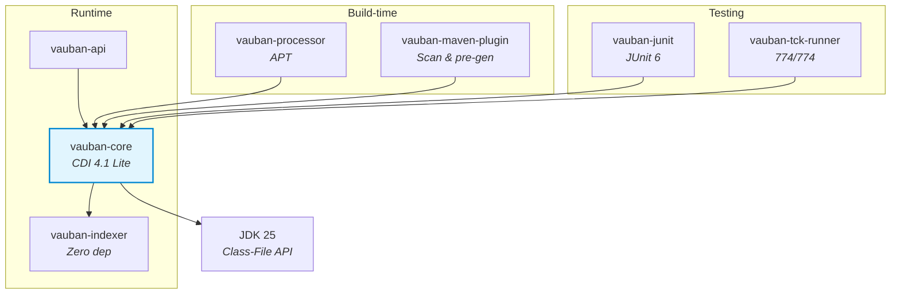

<p align="center">
  
</p>

<h1 align="center">Vauban</h1>

<p align="center">
  <strong>Java Modules-native CDI 4.1 container :)</strong><br>
  <a href="https://jakarta.ee/specifications/cdi/4.1/">CDI 4.1</a> | JDK 25 | JPMS | Virtual Threads | Zero reflection
</p>

<p align="center">
  
  
  
  
  
</p>

---

## What is Vauban?

Vauban is an implementation of [Jakarta CDI 4.1](https://jakarta.ee/specifications/cdi/4.1/) designed from the ground up for the Java Platform Module System (JPMS). It generates all the required code (factories, proxies, interceptors) at compile time using the JDK 25 Class-File API, with no external bytecode dependency.

### Why Vauban?

| | Weld | ArC (Quarkus) | **Vauban** |
|---|---|---|---|
| Approach | Runtime / reflection | Build-time / Jandex + ASM | **Build-time / Class-File API** |
| JPMS | No | No | **Native** |
| Bytecode dependencies | ASM / ByteBuddy | ASM | **None** (pure JDK) |
| CDI Lite TCK | ~100% | ~100% | **100% (774/774)** |

### Philosophy

- **JPMS-first**: every component is an explicit Java module (`module-info.java`)
- **Zero reflection**: static code generation via the JDK 25 Class-File API
- **Virtual threads ready**: `ScopedValue` (JEP 487) instead of `ThreadLocal` everywhere
- **Minimal dependencies**: the indexer has no external dependency
- **Build Compatible Extensions**: CDI 4.1 Lite extension model

## Quick Start

### Prerequisites

- JDK 25 (Temurin)
- Maven 3.9.16

```bash
# With SDKMAN!
sdk env install
```

### Three Ways to Declare Beans

| Mode | When to use it | API |
|------|-----------------|-----|
| **`scanLocal()`** | Standard application | Scans the caller's package + sub-packages |
| **`scanPackage()` + `scanClasspath()`** | Multi-module, CDI dependencies | Explicit scan + beans from JARs (via `vauban-maven-plugin`) |
| **`addBeanClass()`** | Unit tests | Each bean is listed by hand — surgical scope |

### Standard Application (`scanLocal`)

```java
import io.vidocq.vauban.core.container.VaubanContainer;

// Automatically scans the caller's package (com.example.**)
var container = VaubanContainer.builder()
    .scanLocal()
    .build();

var service = container.select(MyService.class);
service.process(42);
container.close();
```

### Multi-module with CDI Dependencies (`scanClasspath`)

Beans in dependency JARs are discovered at build time by `vauban-maven-plugin`
and listed in `META-INF/vauban-beans.list`. At runtime, `scanClasspath()` loads them.

```xml
<!-- pom.xml -->
<plugin>
  <groupId>io.vidocq.vauban</groupId>
  <artifactId>vauban-maven-plugin</artifactId>
  <executions>
    <execution>
      <goals><goal>generate</goal></goals>
    </execution>
  </executions>
</plugin>
```

```java
var container = VaubanContainer.builder()
    .scanClasspath()                    // beans from dependencies (JARs)
    .scanPackage("com.example.app")     // local beans
    .build();
```

> The `vauban:generate` plugin also pre-generates the client proxies (`_ClientProxy`)
> and the intercepted subclasses (`$$Intercepted`) with deterministic naming.
> At runtime, those classes are found on the classpath without regeneration.

### Unit Tests (`addBeanClass`)

Controlled scope — no implicit scan, no unexpected bean:

```java
var container = VaubanContainer.builder()
    .addBeanClass(MyService.class)
    .addBeanClass(MyRepository.class)
    .build();
```

### CDI Beans

```java
@ApplicationScoped
public class MyService {

    @Inject
    MyRepository repository;

    public String process(int id) {
        return repository.trouver(id).nom();
    }
}

@Dependent
public class MyRepository {
    public Record trouver(int id) {
        return new Record(id, "Item " + id);
    }

    public record Record(int id, String nom) {}
}
```

### Testing with JUnit 6

`@AddBeans` explicitly declares the classes to include in the test container.
Controlled scope — no implicit scan, no unexpected bean.

```java
@VaubanTest
@AddBeans({MyService.class, MyRepository.class})
class MyServiceTest {

    @Inject
    MyService service;

    @Test
    void devraitTraiterCorrectement() {
        assertNotNull(service.process(1));
    }
}
```

### CDI Events

```java
@ApplicationScoped
public class NotificationService {

    @Inject
    Event<Commande> commandeEvent;

    public void passer(Commande cmd) {
        commandeEvent.fire(cmd);
    }
}

@ApplicationScoped
public class AuditService {

    void onCommande(@Observes Commande cmd) {
        System.out.println("Commande recue: " + cmd);
    }
}
```

### Interceptors

```java
@InterceptorBinding
@Target({TYPE, METHOD})
@Retention(RUNTIME)
public @interface Logged {}

@Logged @Interceptor @Priority(1000)
public class LogInterceptor {

    @AroundInvoke
    public Object log(InvocationContext ctx) throws Exception {
        System.out.println(">> " + ctx.getMethod().getName());
        return ctx.proceed();
    }
}

@ApplicationScoped
@Logged
public class MyService {
    public String process(int id) { return "OK"; }
}
```

---

## Architecture

> Detailed documentation with Mermaid diagrams: [docs/architecture.md](docs/architecture.md)



```
vauban/
├── vauban-indexer            Bytecode indexer (replaces Jandex), zero dependency
├── vauban-api                Public Vauban API
├── vauban-core               CDI 4.1 Lite container runtime
├── vauban-processor          Annotation processor (compile-time)
├── vauban-maven-plugin       Maven plugin: scan, generation, encryption, distribution
├── vauban-classloader-spi    SPI for class-loading plugins (extensible)
├── vauban-sjar               In-JAR AES-256-GCM encryption (SPI implementation)
├── vauban-junit              JUnit 6 extension for CDI tests
├── vauban-tck-runner         CDI TCK 4.1 runner (774/774)
├── vauban-test-suite         Integration test suite
└── vauban-examples           Multi-module examples (plain + encrypted + distribution)
```

---

## Modules

### vauban-indexer

**Role**: Scan and index `.class` files without reflection or external dependencies.

Functional equivalent of Jandex, but uses exclusively the JDK 25 Class-File API.
Produces an immutable `VaubanIndex` containing the metadata of every scanned class.

| Class | Role |
|--------|------|
| `ClassFileScanner` | Parses a JDK 25 `.class` file into `ClassInfo` |
| `JarScanner` | Scans a full JAR |
| `IndexBuilder` | Builds an index incrementally |
| `VaubanIndex` | Immutable index — queries by name, annotation, supertype |
| `ClassInfo` | Class metadata (annotations, fields, methods, supertypes) |
| `TypeInfo` | Type representation (class, parameterized, wildcard, type variable, array) |
| `DotName` | Internal qualified name (`jakarta.inject.Inject`) |

**JPMS module**: `io.vidocq.vauban.indexer` — zero external dependency.

```java
var index = new IndexBuilder()
    .scan(MyService.class)
    .scan(MyRepository.class)
    .build();

var beans = index.getAnnotatedClasses(DotName.of("jakarta.enterprise.context.ApplicationScoped"));
```

### vauban-api

**Role**: Public entry point for applications.

Provides the `Vauban` facade and re-exports the CDI 4.1 contracts.

**JPMS module**: `io.vidocq.vauban.api` — depends on the Jakarta CDI API (transitive).

### vauban-core

**Role**: The heart of the CDI container. Manages the bean lifecycle, injection, scopes, events, interceptors, and Build Compatible Extensions.

#### Key packages and classes

| Package | Key classes | Role |
|---------|-------------|------|
| `container` | `VaubanContainer`, `VaubanBeanManager`, `ManagedBean`, `InstanceImpl` | Bootstrap, bean management, lifecycle |
| `bean.discovery` | `BeanDiscovery` | CDI discovery via the index |
| `bean.model` | `BeanDescriptor`, `InterceptorDescriptor`, `ObserverDescriptor` | Metadata models |
| `bean.resolution` | `BeanResolver`, `QualifierMatcher` | Bean resolution by type + qualifiers |
| `bean.validation` | `ClassValidator`, `DeploymentValidator` | DefinitionException / DeploymentException validation |
| `context` | `ApplicationContext`, `RequestContext`, `DependentContext` | Scope implementations |
| `event` | `EventDispatcher`, `EventImpl`, `VaubanObserverMethod` | Sync/async fire, observer matching |
| `interceptor` | `InterceptorManager`, `VaubanInvocationContext`, `InterceptorSubclassGenerator` | Resolution, chains, `$$Intercepted` subclass generation |
| `extensions` | `BceProcessor`, `VaubanBuildServices` | Build Compatible Extensions (Discovery → Validation phases) |
| `langmodel` | `VaubanClassInfo`, `VaubanAnnotationMember` | CDI Language Model (`jakarta.enterprise.lang.model`) |
| `types` | `AssignabilityRules`, `TypeHierarchyResolver` | CDI 4.1 Section 2.4 assignability rules |
| `proxy` | `RuntimeClientProxyGenerator` | Client proxy generation via Class-File API |

#### Startup sequence (`VaubanContainer.builder().build()`)

```
1. Collect bean classes (classpath or programmatic)
2. BeanDiscovery: index scan, annotated-mode discovery
   ├── Managed beans (scopes, stereotypes)
   ├── Producers (@Produces methods/fields)
   ├── Observers (@Observes / @ObservesAsync)
   └── Interceptors (@Interceptor + @InterceptorBinding)
3. ClassValidator: DefinitionException validation
4. BceProcessor: Build Compatible Extensions
   ├── @Discovery → @Enhancement → @Registration → @Synthesis → @Validation
   └── Synthetic beans/observers
5. DeploymentValidator: DeploymentException validation
6. Create scopes (ApplicationContext, RequestContext, DependentContext)
7. InterceptorManager: resolve interceptor chains
8. EventDispatcher: register observers
9. VaubanBeanManager: CDI BeanManager facade
10. Fire @Initialized(ApplicationScoped.class) and @Startup
```

#### Injection

The `BeanResolver` resolves injection points by type + qualifiers:
- Supports `@Inject` on fields, constructors, and methods
- Qualifiers: `@Named`, `@Default`, `@Any`, custom qualifiers
- `@Typed` to restrict the exposed types
- `Instance<T>` for programmatic lookup
- `InjectionPoint` for injection metadata

#### Events

`EventDispatcher` handles synchronous and asynchronous fire:
- Matching by event type (including generics) and qualifiers
- Observer ordering by `@Priority`
- Conditional `@Observes(during = IF_EXISTS)` support
- `fireAsync()` returns `CompletionStage<U>`
- `EventMetadata` with resolved runtime type

#### Interceptors

Generated via the Class-File API — zero reflection at runtime:
- `BeanClass$$Intercepted` subclass with overridden methods
- `$$super$methodName` bridge to call the original method
- `@AroundInvoke` and `@AroundConstruct`
- Binding matching by name + member values
- Support for inherited and transitive bindings (via stereotypes)

**JPMS module**: `io.vidocq.vauban.core` — provides `CDIProvider` and `BuildServices`.

### vauban-processor

**Role**: Annotation processor (APT) that generates bean factories and client proxies at compile time.

| Class | Role |
|--------|------|
| `VaubanProcessor` | APT entry point (`AbstractProcessor`) |
| `ElementScanner` | Converts APT elements into `ClassInfo` |
| `BeanFactoryGenerator` | Generates `BeanFactory<T>` implementations |
| `ClientProxyGenerator` | Generates client proxies for normal scopes |

**Flow**:
1. APT detects the CDI annotations
2. Scan elements → `VaubanIndex`
3. `BeanDiscovery` + `DeploymentValidator`
4. Bytecode generation via the Class-File API for each managed bean

**JPMS module**: `io.vidocq.vauban.processor` — depends on `java.compiler`.

### vauban-junit

**Role**: JUnit 6 (Jupiter) integration for CDI tests.

| Class | Role |
|--------|------|
| `VaubanExtension` | JUnit extension (`BeforeAllCallback`, `AfterAllCallback`, `TestInstancePostProcessor`) |
| `@VaubanTest` | Marks a test class for CDI |
| `@AddBeans` | Declares the bean classes to include in the test container |

**How it works**:
1. `@BeforeAll`: creates a `VaubanContainer` with the `@AddBeans` classes
2. `PostProcessor`: injects the `@Inject` fields of the test instance
3. `@AfterAll`: closes the container

```java
@VaubanTest
@AddBeans({MyService.class, MyRepository.class})
class MyServiceTest {
    @Inject MyService service;

    @Test
    void test() {
        assertNotNull(service.process(1));
    }
}
```

**JPMS module**: `io.vidocq.vauban.junit` — depends on `org.junit.jupiter.api`.

### vauban-classloader-spi

**Role**: Permanent class-loading contract — SPI interfaces for loading classes from custom sources (encrypted JARs, remote archives, etc.).

This module is **always required at runtime** by `vauban-core`, `vauban-indexer`, and `vauban-processor`. Without an implementation on the module path, the container uses standard Java class loading. The presence of an implementation (e.g. `vauban-sjar`) enables custom class loading via `ServiceLoader`.

| Interface | Role |
|-----------|------|
| `ByteSourcePlugin` | Declares the supported archive format (protocol, handles, open) |
| `ArchiveReader` | Provides the (decrypted) bytes of an archive's classes |
| `PluginContext` | Provides keys and configuration to plugins |

**JPMS module**: `io.vidocq.vauban.classloader.spi` — no external dependency.

### vauban-sjar

**Role**: Paid, optional SPI implementation for in-JAR AES-256-GCM encryption. Absent from the module path by default (open-source edition); present only in the commercial edition intended to become pure EE.

| Class | Role |
|--------|------|
| `SjarEncryptor` | Encrypts the internal classes of a modular JAR in-place |
| `SjarPlugin` | `ByteSourcePlugin` implementation — detects `META-INF/vauban.encrypted` |
| `SjarArchiveReader` | Reads and decrypts the `.class.enc` files with an in-memory cache |
| `SjarKeyProvider` | Key resolution (env, keystore, programmatic) |
| `SjarClassLoader` | Custom ClassLoader for encrypted classes |

Encryption is driven by `module-info.class`:
- `exports`/`opens` packages → in clear (compilable)
- All other packages → encrypted (`.class.enc`)
- `META-INF/vauban.encrypted` → JSON metadata

Full documentation: [vauban-sjar/README.md](vauban-sjar/README.md)

**JPMS module**: `io.vidocq.vauban.sjar` — provides `ByteSourcePlugin` via `ServiceLoader`.

### vauban-maven-plugin

**Role**: Build-time CDI bean discovery, proxy pre-generation, class encryption, and distribution packaging.

| Class | Role |
|--------|------|
| `VaubanGenerator` | Core: scan JARs → index → discover → generate proxies/interceptors → write `vauban-beans.list` |
| `GenerateMojo` | `vauban:generate` goal, `process-classes` phase |
| `EncryptMojo` | `vauban:encrypt` goal, `package` phase — encrypts the internal classes |
| `DistMojo` | `vauban:dist` goal, `package` phase — distribution ZIP with scripts |
| `ModuleAnalyzer` | JPMS analysis (explicit/automatic modules, split packages) |

| Goal | Phase | Description |
|------|-------|-------------|
| `vauban:generate` | process-classes | Scan deps + project, CDI discovery, proxy pre-generation, write `vauban-beans.list` |
| `vauban:encrypt` | package | AES-256-GCM encryption of the internal classes (based on `module-info`) |
| `vauban:dist` | package | Distribution ZIP with `bin/run.sh`, `bin/run.cmd`, and `lib/*.jar` |

```xml
<plugin>
  <groupId>io.vidocq.vauban</groupId>
  <artifactId>vauban-maven-plugin</artifactId>
  <executions>
    <execution><goals><goal>generate</goal></goals></execution>
    <execution>
      <id>encrypt</id>
      <goals><goal>encrypt</goal></goals>
      <configuration><keyAlias>my-key</keyAlias></configuration>
    </execution>
    <execution>
      <id>dist</id>
      <goals><goal>dist</goal></goals>
      <configuration><mainClass>com.example.Main</mainClass></configuration>
    </execution>
  </executions>
</plugin>
```

### vauban-tck-runner

**Role**: Runs the official CDI TCK 4.1 against Vauban.

**Stack**: Arquillian 1.8 + TestNG 7.9 + ShrinkWrap.

```bash
# Run the full TCK
./run-tck.sh

# Un test specifique
./run-tck.sh -Dtest=EventMetadataTest
```

**Current result**: **774/774 CDI Lite tests (100%)**

### vauban-test-suite

**Role**: Integration tests covering end-to-end CDI scenarios (injection, scopes, events, interceptors, producers).

---

## CDI 4.1 Lite Features

| Feature | Status |
|---|---|
| Managed beans (`@ApplicationScoped`, `@RequestScoped`, `@Dependent`, `@Singleton`) | ✅ |
| Injection (`@Inject` fields, constructors, methods) | ✅ |
| Qualifiers (`@Named`, `@Default`, `@Any`, custom, `@Nonbinding`) | ✅ |
| Producers (`@Produces` methods and fields) | ✅ |
| Disposers (`@Disposes`) | ✅ |
| Events (`Event<T>`, `@Observes`, `@ObservesAsync`) | ✅ |
| Stereotypes (`@Stereotype`) | ✅ |
| Alternatives (`@Alternative`, `@Priority`) | ✅ |
| `Instance<T>` programmatic lookup | ✅ |
| `InjectionPoint` metadata | ✅ |
| `@Typed` type restriction | ✅ |
| `@Vetoed` (class and package) | ✅ |
| Observer priority and conditional (`IF_EXISTS`) | ✅ |
| Interceptors (`@AroundInvoke`, `@AroundConstruct`) | ✅ |
| Client proxies (normal scopes) | ✅ |
| Build Compatible Extensions (BCE) | ✅ |
| `@TransientReference` | ✅ |
| `EventMetadata` | ✅ |

## TCK Validation

The container is validated against the official [CDI TCK 4.1](https://github.com/jakartaee/cdi-tck).

```
CDI Lite TCK :  774/774 tests (100%)
CDI Full TCK :  not targeted (future vauban-full module)
```

| Profile | Scope | Status |
|--------|-------|--------|
| **CDI Lite** | Managed beans, injection, events, producers, interceptors, BCE | **100% TCK** |
| **CDI Full** | + Portable Extensions, decorators, conversation scope, EL | Future (`vauban-full`) |

## Documentation

| Document | Contents |
|----------|---------|
| [docs/architecture.md](docs/architecture.md) | Architecture, Mermaid diagrams, startup sequences |
| [docs/configuration.md](docs/configuration.md) | Configuration properties reference |
| [docs/getting-started.md](docs/getting-started.md) | Quick start guide |

## Quality

- **SonarQube**: 0 issues (0 bugs, 0 vulnerabilities, 0 open code smells)
- **JaCoCo**: coverage via the `quality` Maven profile

```bash
# Quality analysis
mvn verify -Pquality -pl vauban-core
```

## License

[EPL-2.0 OR EUPL-1.2 OR GPL-2.0-or-later](LICENSE)
