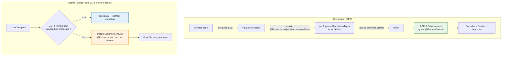
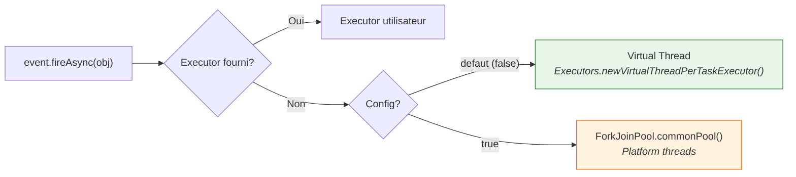

# Configuration Vauban

Vauban se configure via des **proprietes systeme** (`-D...`) ou des **variables d'environnement**.
La propriete systeme prend toujours priorite sur la variable d'environnement equivalente.

## Reference des proprietes

| Propriete systeme | Variable d'environnement | Defaut | Description |
|---|---|---|---|
| `VaubanUsePlatformThreadsForAsyncEvents` | `VAUBAN_USE_PLATFORM_THREADS_FOR_ASYNC_EVENTS` | `false` | Si `true`, les evenements asynchrones (`fireAsync`) utilisent le `ForkJoinPool.commonPool()` (platform threads) au lieu de virtual threads. |

---

## Enrichissement de beans via Build Compatible Extensions (BCE)

Vauban permet de promouvoir des classes non-CDI en beans CDI grace aux BCEs
`@Enhancement`. Le mecanisme est **standard CDI 4.1** et fonctionne a la fois
a la compilation (APT) et au runtime (fallback pour les JARs non pre-traites).

### Prerequis : `vauban-processor` en dependance `provided`

```xml
<dependency>
    <groupId>io.vidocq.vauban</groupId>
    <artifactId>vauban-processor</artifactId>
    <scope>provided</scope>
</dependency>
```

> **IDE** : l'annotation processing doit etre active (IntelliJ : Settings →
> Compiler → Annotation Processors → Enable). Sans ca, les BCEs ne s'executent
> qu'au runtime (fallback).

### Exemple : JAX-RS avec CDI

Une BCE ajoute automatiquement `@RequestScoped` aux classes `@Path` sans scope :

```java
public class RestScopeExtension implements BuildCompatibleExtension {

    @Enhancement(types = Object.class, withAnnotations = Path.class)
    public void addDefaultScope(ClassConfig clazz) {
        // Ne pas ecraser un scope explicite
        if (!hasScope(clazz)) {
            clazz.addAnnotation(RequestScoped.class);
        }
    }
}
```

Enregistree dans `META-INF/services/jakarta.enterprise.inject.build.compatible.spi.BuildCompatibleExtension`.

### Fonctionnement



**A la compilation** : le `VaubanProcessor` decouvre les BCEs via ServiceLoader, extrait
les `@Enhancement(withAnnotations=...)` pour inclure ces annotations dans les types
supportes, et execute les 5 phases BCE. Les classes `@Path` sont scannees, enrichies,
et generees normalement.

**Au runtime** : pour les JARs de dependances sans marqueur `vauban-bce-processed`,
le conteneur execute `processEnhancementOnly()` — une version allegee qui n'execute
que les methodes `@Enhancement` des BCEs. Les classes enrichies sont integrees dans
l'index avant `BeanDiscovery`. Performance : < 1ms pour des dizaines de beans.

### Regles

- Une classe **deja annotee** avec un scope CDI n'est **pas modifiee** par l'Enhancement
- L'annotation trigger (ex: `@Path`) doit etre sur le **classpath**
- Les BCEs sont executees dans l'ordre de `@Priority` (par defaut APPLICATION + 500)
- Le marqueur `META-INF/vauban-bce-processed` est **par source** (JAR/repertoire) : un JAR
  pre-traite est skippe, un JAR tiers sans marqueur est enrichi au runtime

---

## Details

### Async Events : threading model

Par defaut, `Event.fireAsync()` execute les observers asynchrones sur des **virtual threads**
via `Executors.newVirtualThreadPerTaskExecutor()`. Chaque notification d'evenement cree un
virtual thread dedie, leger et non bloquant pour le scheduler OS.



**Priorite de l'executor :**

1. `NotificationOptions.ofExecutor(myExecutor)` — toujours prioritaire
2. `Executors.newVirtualThreadPerTaskExecutor()` — defaut
3. `ForkJoinPool.commonPool()` — si `VaubanUsePlatformThreadsForAsyncEvents=true`

#### Utilisation

```bash
# Virtual threads (defaut, rien a faire)
java -jar mon-app.jar

# Forcer les platform threads
java -DVaubanUsePlatformThreadsForAsyncEvents=true -jar mon-app.jar

# Via variable d'environnement
export VAUBAN_USE_PLATFORM_THREADS_FOR_ASYNC_EVENTS=true
java -jar mon-app.jar

# Executor custom par evenement (toujours possible)
event.fireAsync(obj, NotificationOptions.ofExecutor(myExecutor));
```

#### Quand utiliser les platform threads ?

Les platform threads peuvent etre preferes dans certains cas :

- **Debugging** : les virtual threads ont des stack traces differentes
- **Compatibilite** : bibliotheques utilisant `ThreadLocal` (non compatible virtual threads)
- **Controle du parallelisme** : le `ForkJoinPool` a une taille fixe, les virtual threads non

Dans la majorite des cas, les virtual threads sont le meilleur choix.
