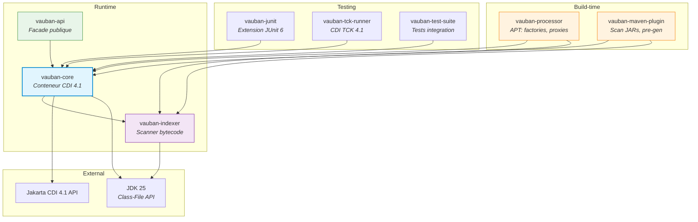
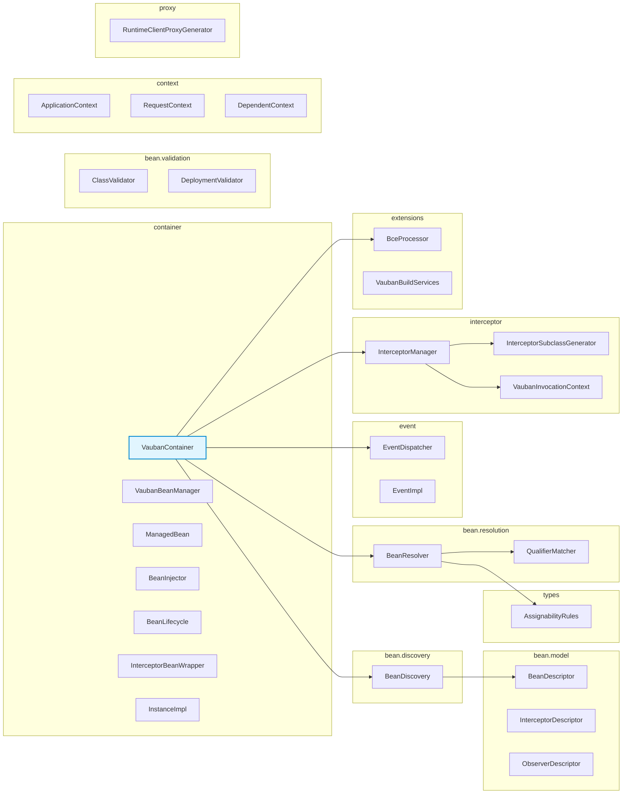
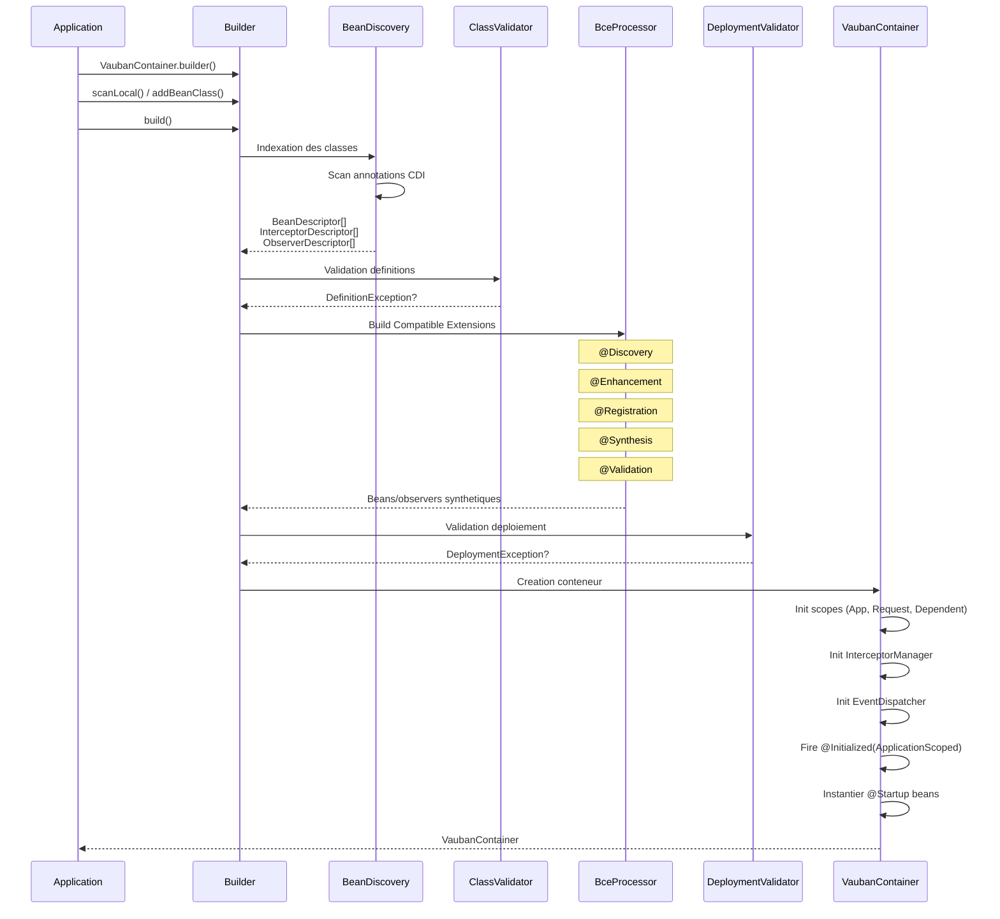
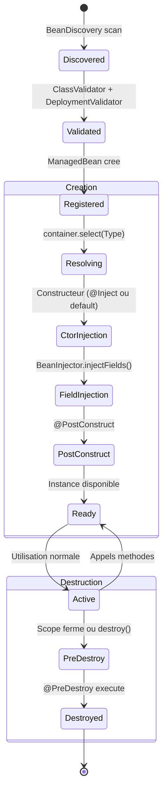
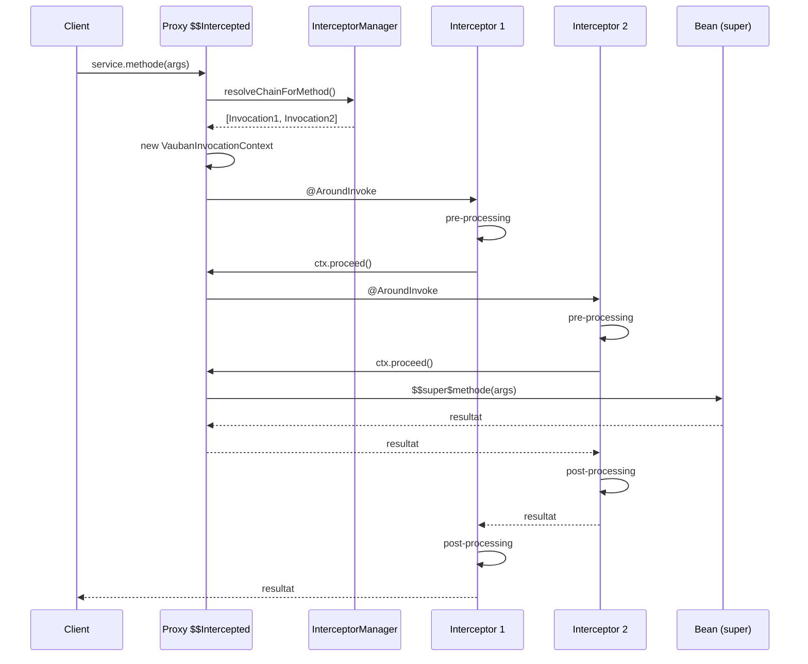
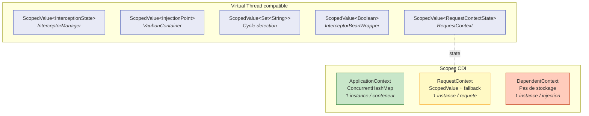
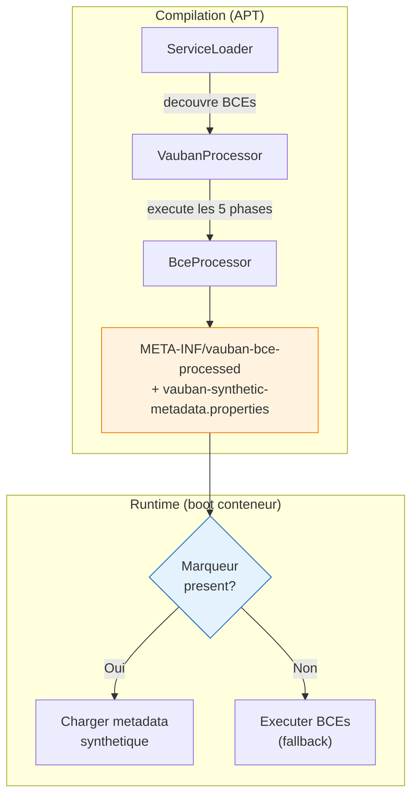
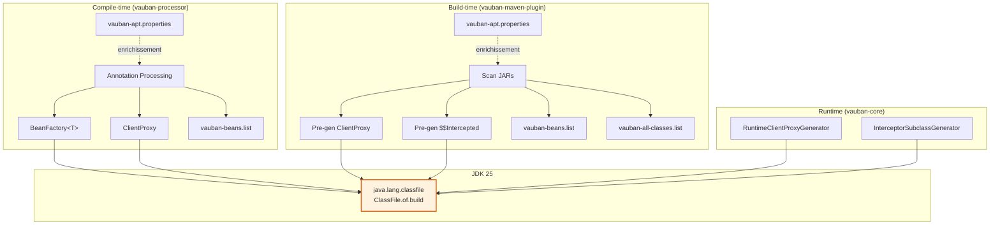

# Architecture Vauban

> Vue d'ensemble de l'architecture du conteneur CDI 4.1 Vauban.

## Modules



Chaque module est un **module JPMS explicite** avec son `module-info.java`.

| Module | Dependances externes |
|--------|---------------------|
| `vauban-indexer` | **Aucune** (JDK pur) |
| `vauban-core` | Jakarta CDI API, Jakarta Inject, Jakarta Interceptors |
| `vauban-api` | Jakarta CDI API (transitif) |
| `vauban-processor` | `java.compiler` (APT) |
| `vauban-junit` | JUnit Jupiter |

---

## Packages de vauban-core



---

## Sequence de demarrage



---

## Cycle de vie d'un bean



---

## Resolution d'injection

```mermaid
flowchart TD
    IP[Point d'injection<br/><code>@Inject MyService svc</code>] --> TYPE{Type demande}

    TYPE -->|Instance/Provider| INSTANCE[InstanceImpl<br/>Lookup programmatique]
    TYPE -->|Event| EVENT[EventImpl<br/>Fire evenements]
    TYPE -->|BeanManager| BM[VaubanBeanManager<br/>Facade CDI]
    TYPE -->|InjectionPoint| IPN[Metadata InjectionPoint]
    TYPE -->|Bean classique| RESOLVE

    RESOLVE[BeanResolver.resolve] --> MATCH{Beans trouves?}
    MATCH -->|0| UNSAT[UnsatisfiedResolutionException]
    MATCH -->|1| FOUND[Bean resolu]
    MATCH -->|2+| AMBIG{Alternatives?}

    AMBIG -->|@Priority| PRIO[Plus haute priorite]
    AMBIG -->|Aucune| AMB_ERR[AmbiguousResolutionException]
    PRIO --> FOUND

    FOUND --> SCOPE{Scope?}
    SCOPE -->|@Dependent| DIRECT[Instance directe]
    SCOPE -->|@ApplicationScoped| PROXY[Client proxy]
    SCOPE -->|@RequestScoped| PROXY
    PROXY --> CTX[Context.get<br/>ou create]
    DIRECT --> CTX

    style IP fill:#e1f5fe,stroke:#0288d1
    style FOUND fill:#e8f5e9,stroke:#388e3c
    style UNSAT fill:#ffebee,stroke:#c62828
    style AMB_ERR fill:#ffebee,stroke:#c62828
```

---

## Evenements asynchrones

```mermaid
sequenceDiagram
    participant App as Application
    participant E as Event&lt;T&gt;
    participant ED as EventDispatcher
    participant VT as Virtual Thread
    participant O1 as Observer 1
    participant O2 as Observer 2

    App->>E: fireAsync(event)
    E->>ED: fireAsync(event, null)
    ED->>VT: supplyAsync(task, virtualThreadExecutor)
    activate VT
    Note over VT: Virtual thread demarre
    VT->>O1: invokeObserver()
    O1-->>VT: ok
    VT->>O2: invokeObserver()
    O2-->>VT: ok
    VT-->>App: CompletionStage&lt;T&gt;
    deactivate VT
```

Par defaut, les observers `@ObservesAsync` sont executes sur un **virtual thread** via
`Executors.newVirtualThreadPerTaskExecutor()`. Ce comportement est configurable — voir
[docs/configuration.md](configuration.md).

**Priorite de l'executor :**
1. `NotificationOptions.ofExecutor(customExecutor)` — passe par l'utilisateur
2. Virtual thread executor — defaut Vauban
3. `ForkJoinPool.commonPool()` — si `VaubanUsePlatformThreadsForAsyncEvents=true`

---

## Chaine d'interception



Le code genere par `InterceptorSubclassGenerator` via l'API Class-File du JDK 25 :

```
BeanClass$$Intercepted extends BeanClass
├── methode()        → resolve chain → VaubanInvocationContext.proceed()
├── $$super$methode() → super.methode()  (bridge vers la methode originale)
└── $$manager        → reference InterceptorManager
```

---

## Gestion des scopes avec ScopedValue



**Pourquoi ScopedValue ?**

- Compatible virtual threads (JDK 25, JEP 487 finalise)
- Pas de fuite memoire (lie au scope, pas au thread)
- Herite automatiquement dans les child scopes
- Immutable par design (pas de `set()`, seulement `where().run()`)

---

## Build Compatible Extensions (BCE)


Les extensions BCE sont executees **a la compilation** par le `VaubanProcessor` (APT),
puis skippees au runtime grace au marqueur `META-INF/vauban-bce-processed`.
Si l'APT n'a pas tourne (pas de marqueur), les BCEs s'executent au boot du conteneur (fallback).



**Avantages de l'execution compile-time :**

- Erreurs BCE detectees a la compilation (pas au deploiement)
- Demarrage plus rapide (phases deja executees)
- Beans synthetiques pre-calcules et serialises

Les BCEs permettent de modifier les beans, ajouter des beans synthetiques, et valider le deploiement
sans utiliser les Portable Extensions (CDI Full).

---

## Generation de code (Class-File API JDK 25)



**Trois niveaux de generation :**

1. **Compile-time** (`vauban-processor`) : APT genere factories, proxies et `vauban-beans.list` pour les beans du module courant
2. **Build-time** (`vauban-maven-plugin`) : pre-genere proxies et intercepteurs pour les beans des JARs de dependances
3. **Runtime** (`vauban-core`) : genere a la volee si pas pre-genere (fallback)

Tous utilisent `java.lang.classfile.ClassFile` — **zero dependance bytecode externe** (pas d'ASM, pas de ByteBuddy).

**Enrichissement compile-time** : le fichier `vauban-apt.properties` permet de promouvoir des
classes non-CDI en beans (ex: `@Path` → `@RequestScoped`) sans BCE. Lu par l'APT et le Maven plugin.
Voir [docs/configuration.md](configuration.md#enrichissement-de-beans--vauban-aptproperties).

---

## Fichiers META-INF generes

| Fichier | Genere par | Contenu | Lu par |
|---------|-----------|---------|--------|
| `vauban-beans.list` | APT + Maven plugin | Noms des beans CDI decouverts | `VaubanContainerBuilder.scanClasspath()` |
| `vauban-all-classes.list` | Maven plugin | **Toutes** les classes scannees (beans + non-beans) | `VaubanContainerBuilder.scanClasspath()` |
| `vauban-bce-processed` | APT (si BCEs executees) | Marqueur vide | `VaubanContainerBuilder.build()` — skip BCE runtime |
| `vauban-synthetic-metadata.properties` | APT (si @Synthesis) | Beans/observers synthetiques serialises | `VaubanContainerBuilder.build()` |
| `vauban-apt.properties` | Utilisateur | Regles d'enrichissement annotation → scope | APT + Maven plugin |

**Pourquoi `vauban-all-classes.list` ?**

Les BCEs `@Enhancement` peuvent cibler des classes qui ne sont pas (encore) des beans CDI
(ex: `@Path` sans scope). Ces classes doivent etre chargees et indexees pour que le
`BceProcessor` les passe a l'extension. `vauban-beans.list` ne contient que les beans
decouverts — `vauban-all-classes.list` comble ce manque en listant toutes les classes
du deploiement.
