# Architecture Vauban

> Vue d'ensemble de l'architecture du conteneur CDI 4.1 Vauban.

## Modules

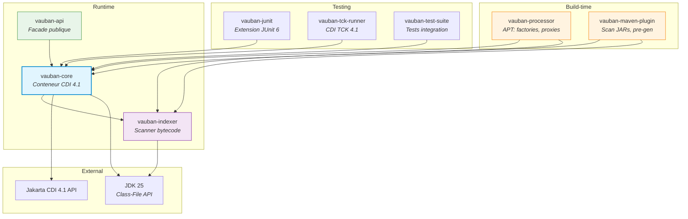

Chaque module est un **module JPMS explicite** avec son `module-info.java`.

| Module | Dependances externes |
|--------|---------------------|
| `vauban-indexer` | **Aucune** (JDK pur) |
| `vauban-core` | Jakarta CDI API, Jakarta Inject, Jakarta Interceptors |
| `vauban-api` | Jakarta CDI API (transitif) |
| `vauban-processor` | `java.compiler` (APT) |
| `vauban-junit` | JUnit Jupiter |

---

## Packages de vauban-core

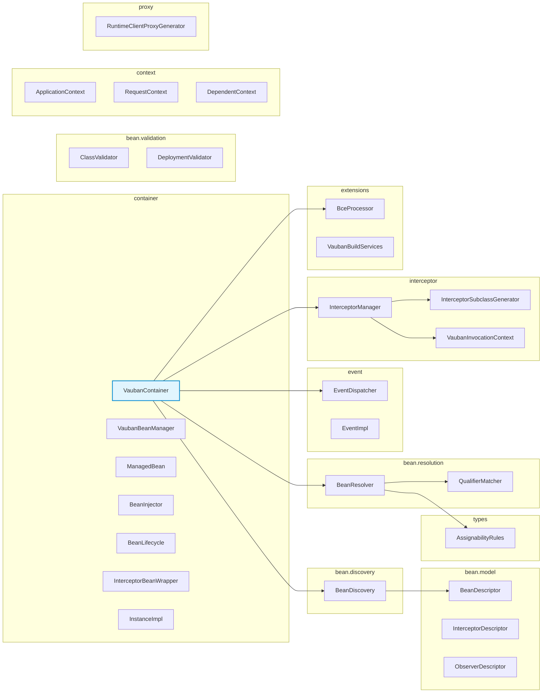

---

## Pipeline de build complet

Les outils Vauban interviennent a **trois moments distincts** du cycle de build Maven :

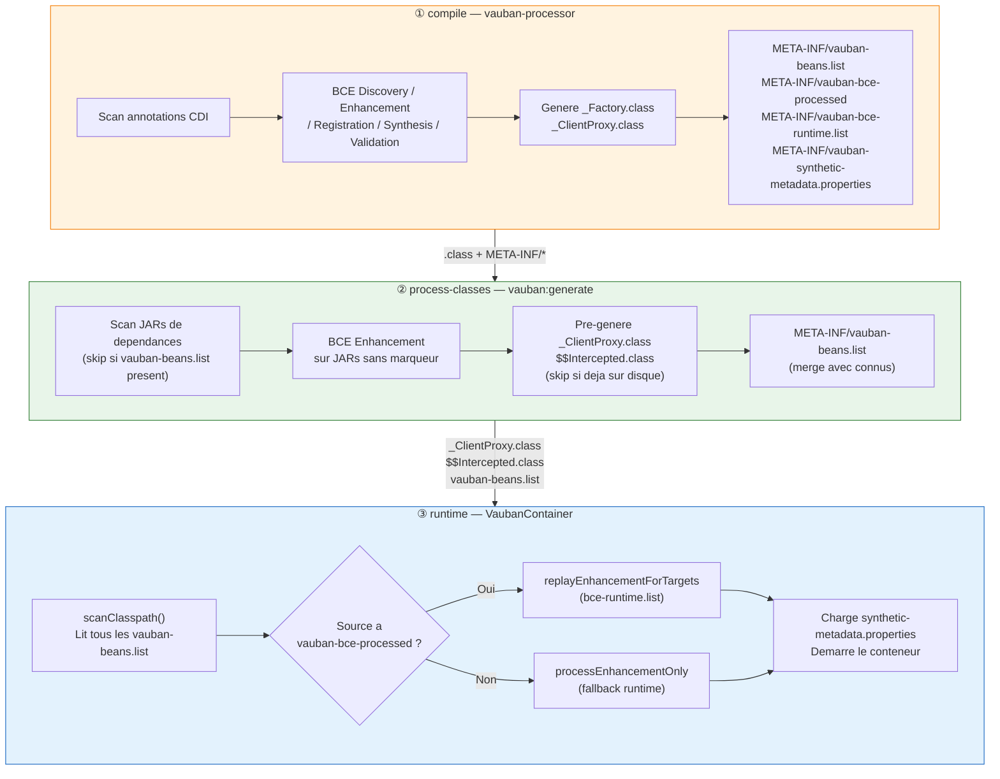

**Regle d'or** : chaque outil evite le double traitement.
- `vauban-processor` genere uniquement les beans du module courant.
- `vauban:generate` skips les JARs/repertoires qui ont deja un `vauban-beans.list`.
- `VaubanContainer` skips le BCE pour les sources marquees `vauban-bce-processed`.

---

## Processus APT (vauban-processor)

`VaubanProcessor extends AbstractProcessor` est le point d'entree de l'annotation processing.
Il est declenche par `javac` pendant la phase `compile`.

### Detection des BCEs et annotations trigger

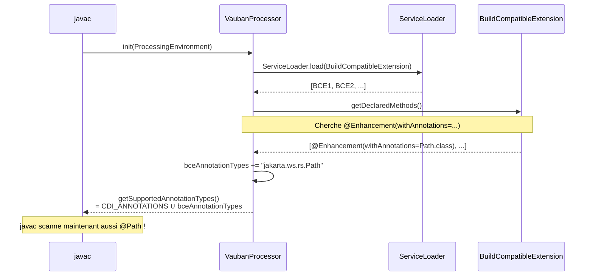

**Pourquoi cette etape est critique** : sans extraire les annotations `withAnnotations` des BCEs,
`javac` n'inclurait pas les classes `@Path` dans le `RoundEnvironment`. Les classes
non-CDI enrichies par BCE seraient invisibles au processeur.

### Flux de traitement (methode process)

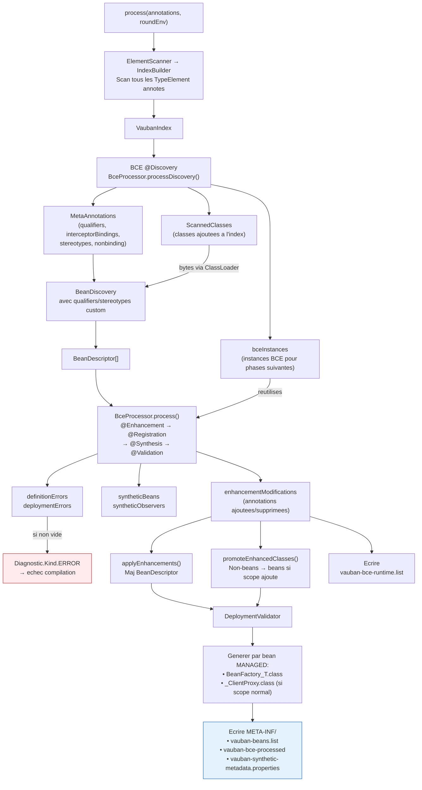

### Matching triple dans @Enhancement

Pour chaque methode `@Enhancement`, `BceProcessor` tente de trouver les classes cibles
par **trois chemins complementaires** :

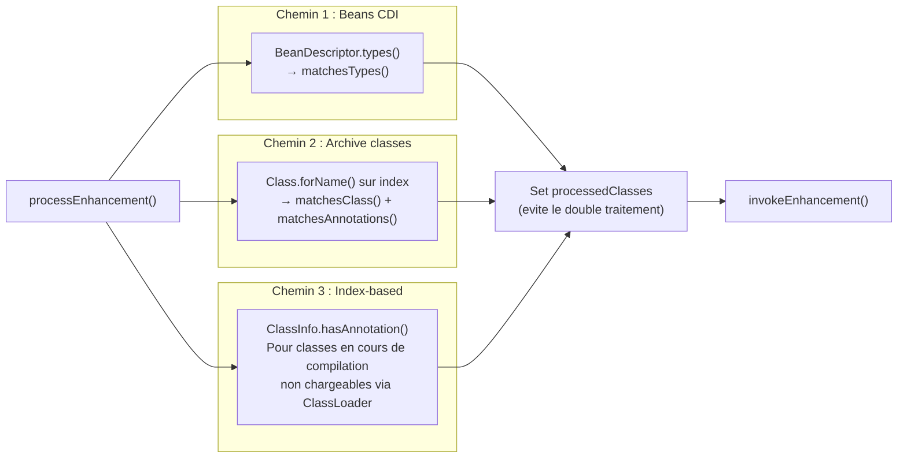

Le chemin 3 (index-based) est essentiel : les classes **en cours de compilation** ne sont
pas encore sur le classpath et ne peuvent pas etre chargees via `Class.forName()`. L'index
`VaubanIndex` construit par `ElementScanner` en phase APT est la seule source de verite.

---

## Plugin Maven (vauban:generate)

Le goal `vauban:generate` s'execute en phase `process-classes` — **apres** `compile`. Les `.class`
du projet sont deja generes (par javac + APT). Le plugin traite les **JARs de dependances**.

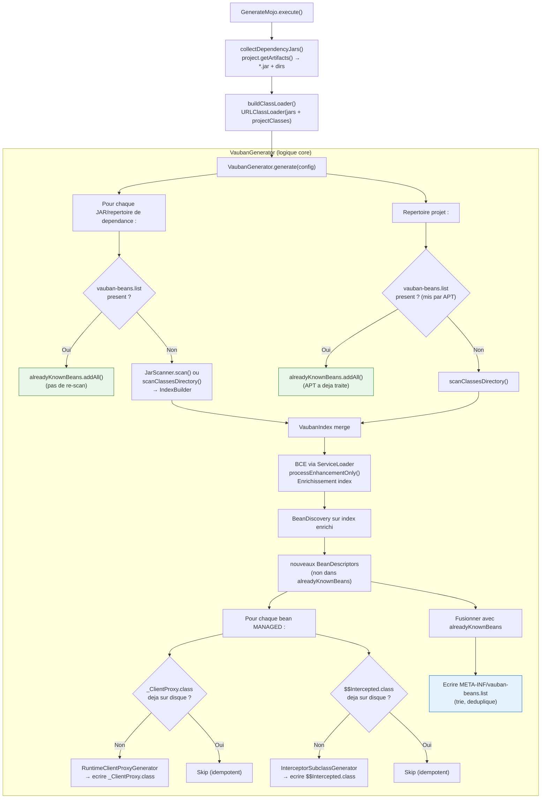

**BCE dans le plugin** : `VaubanGenerator` decouvre les BCEs via `ServiceLoader` sur le
`URLClassLoader` construit a partir des JARs du projet. Il appelle
`BceProcessor.processEnhancementOnly()` — uniquement la phase `@Enhancement` —
pour enrichir l'index avant `BeanDiscovery`. Les classes non-CDI (ex: `@Path`) des JARs
sont ainsi promues en beans avant la generation des proxies.

**Le plugin ne genere pas** `vauban-bce-processed` ni `vauban-bce-runtime.list` :
ces fichiers sont la responsabilite de l'APT.

---

## Sequence de demarrage

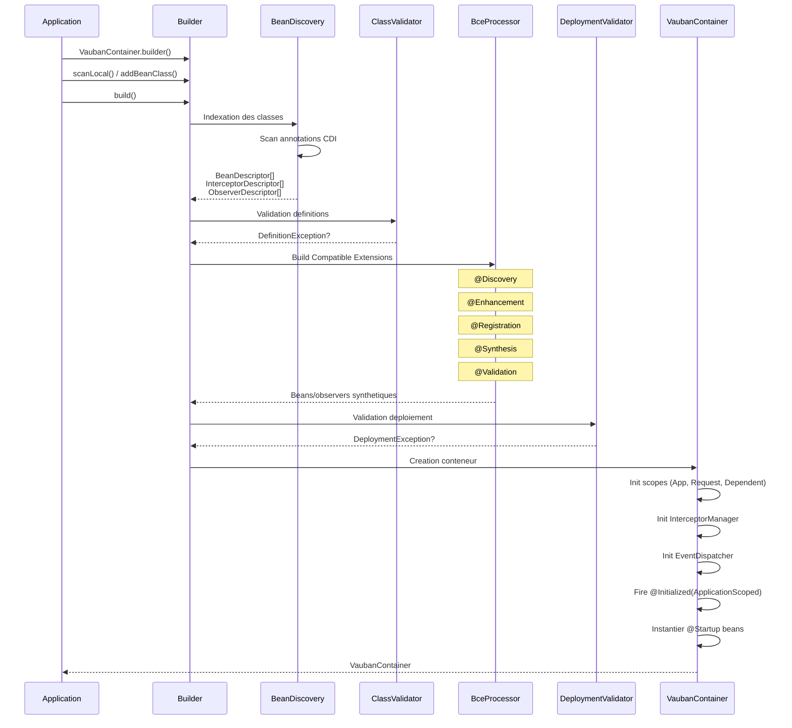

---

## Cycle de vie d'un bean

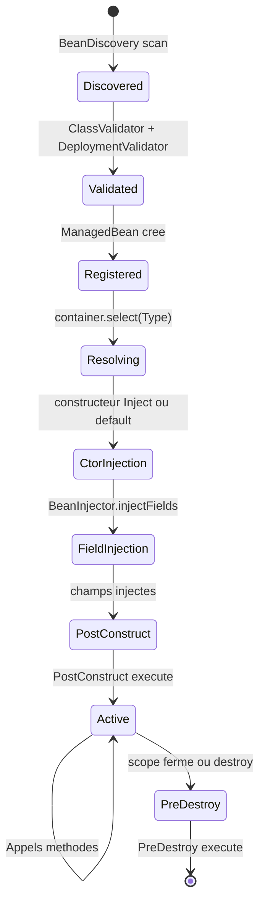

---

## Resolution d'injection

```mermaid
flowchart TD
    IP["Point d'injection\n@Inject MyService svc"] --> TYPE{Type demande}

    TYPE -->|Instance/Provider| INSTANCE[InstanceImpl<br/>Lookup programmatique]
    TYPE -->|Event| EVENT[EventImpl<br/>Fire evenements]
    TYPE -->|BeanManager| BM[VaubanBeanManager<br/>Facade CDI]
    TYPE -->|InjectionPoint| IPN[Metadata InjectionPoint]
    TYPE -->|Bean classique| RESOLVE

    RESOLVE[BeanResolver.resolve] --> MATCH{Beans trouves?}
    MATCH -->|0| UNSAT[UnsatisfiedResolutionException]
    MATCH -->|1| FOUND[Bean resolu]
    MATCH -->|2+| AMBIG{Alternatives?}

    AMBIG -->|@Priority| PRIO[Plus haute priorite]
    AMBIG -->|Aucune| AMB_ERR[AmbiguousResolutionException]
    PRIO --> FOUND

    FOUND --> SCOPE{Scope?}
    SCOPE -->|@Dependent| DIRECT[Instance directe]
    SCOPE -->|@ApplicationScoped| PROXY[Client proxy]
    SCOPE -->|@RequestScoped| PROXY
    PROXY --> CTX[Context.get<br/>ou create]
    DIRECT --> CTX

    style IP fill:#e1f5fe,stroke:#0288d1
    style FOUND fill:#e8f5e9,stroke:#388e3c
    style UNSAT fill:#ffebee,stroke:#c62828
    style AMB_ERR fill:#ffebee,stroke:#c62828
```

---

## Evenements asynchrones

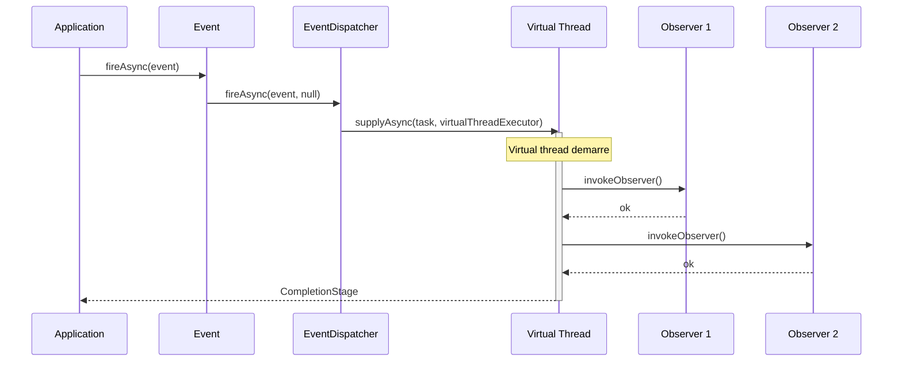

Par defaut, les observers `@ObservesAsync` sont executes sur un **virtual thread** via
`Executors.newVirtualThreadPerTaskExecutor()`. Ce comportement est configurable — voir
[docs/configuration.md](configuration.md).

**Priorite de l'executor :**
1. `NotificationOptions.ofExecutor(customExecutor)` — passe par l'utilisateur
2. Virtual thread executor — defaut Vauban
3. `ForkJoinPool.commonPool()` — si `VaubanUsePlatformThreadsForAsyncEvents=true`

---

## Chaine d'interception

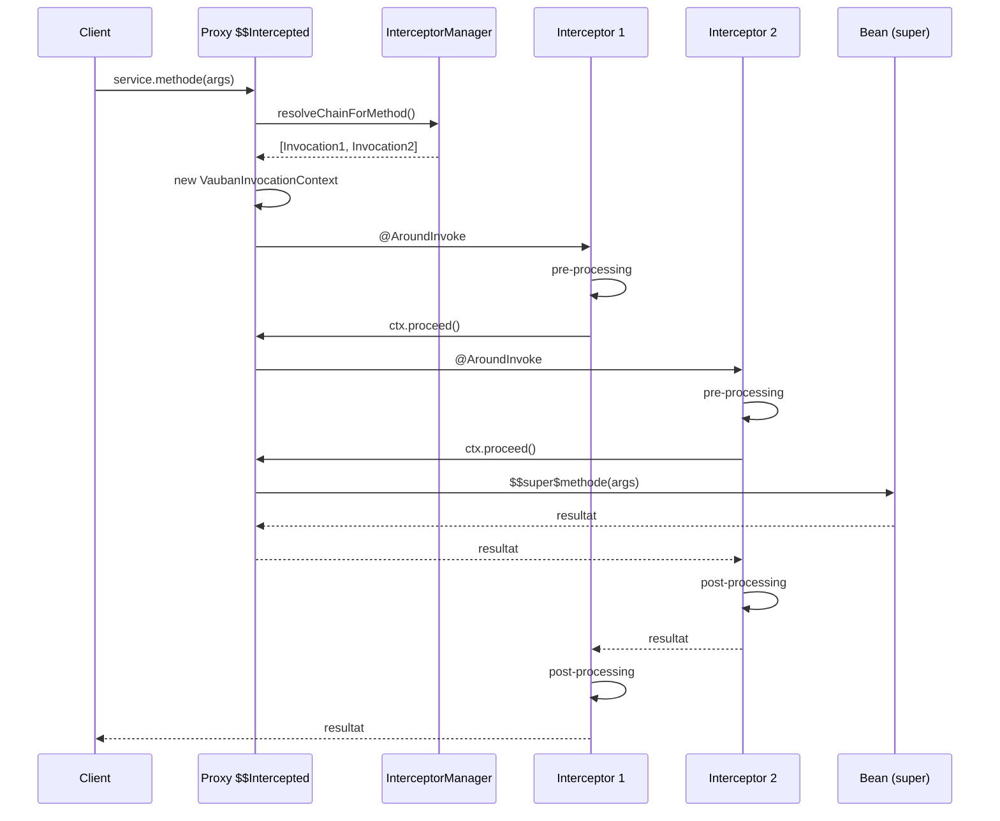

Le code genere par `InterceptorSubclassGenerator` via l'API Class-File du JDK 25 :

```
BeanClass$$Intercepted extends BeanClass
├── methode()        → resolve chain → VaubanInvocationContext.proceed()
├── $$super$methode() → super.methode()  (bridge vers la methode originale)
└── $$manager        → reference InterceptorManager
```

---

## Gestion des scopes avec ScopedValue

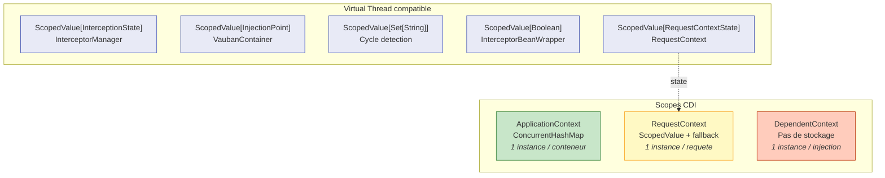

**Pourquoi ScopedValue ?**

- Compatible virtual threads (JDK 25, JEP 487 finalise)
- Pas de fuite memoire (lie au scope, pas au thread)
- Herite automatiquement dans les child scopes
- Immutable par design (pas de `set()`, seulement `where().run()`)

---

## Build Compatible Extensions (BCE)

### Phases du cycle de vie

```mermaid
flowchart LR
    D["@Discovery<br/><i>Decouverte de types</i>"] --> E["@Enhancement<br/><i>Modification annotations</i>"]
    E --> R["@Registration<br/><i>Enregistrement beans</i>"]
    R --> S["@Synthesis<br/><i>Beans synthetiques</i>"]
    S --> V["@Validation<br/><i>Verification finale</i>"]

    D ---|ScannedClasses\nMetaAnnotations| E
    E ---|ClassConfig\nFieldConfig\nMethodConfig| R
    R ---|BeanInfo\nInterceptorInfo\nObserverInfo| S
    S ---|SyntheticBeanBuilder\nSyntheticObserverBuilder| V

    style D fill:#e3f2fd,stroke:#1565c0
    style E fill:#e8f5e9,stroke:#2e7d32
    style R fill:#fff3e0,stroke:#ef6c00
    style S fill:#fce4ec,stroke:#c62828
    style V fill:#f3e5f5,stroke:#6a1b9a
```

### Detection des BCEs

Les BCEs sont decouvertes via **Java ServiceLoader** :

```
META-INF/services/jakarta.enterprise.inject.build.compatible.spi.BuildCompatibleExtension
```

Chaque ligne du fichier de services est le nom qualifie d'une classe implementant `BuildCompatibleExtension`.
L'APT (`VaubanProcessor.init()`), le plugin Maven (`VaubanGenerator`) et le runtime
(`VaubanContainer`) appellent tous `ServiceLoader.load(BuildCompatibleExtension.class, classLoader)`
au demarrage de leur phase respective.

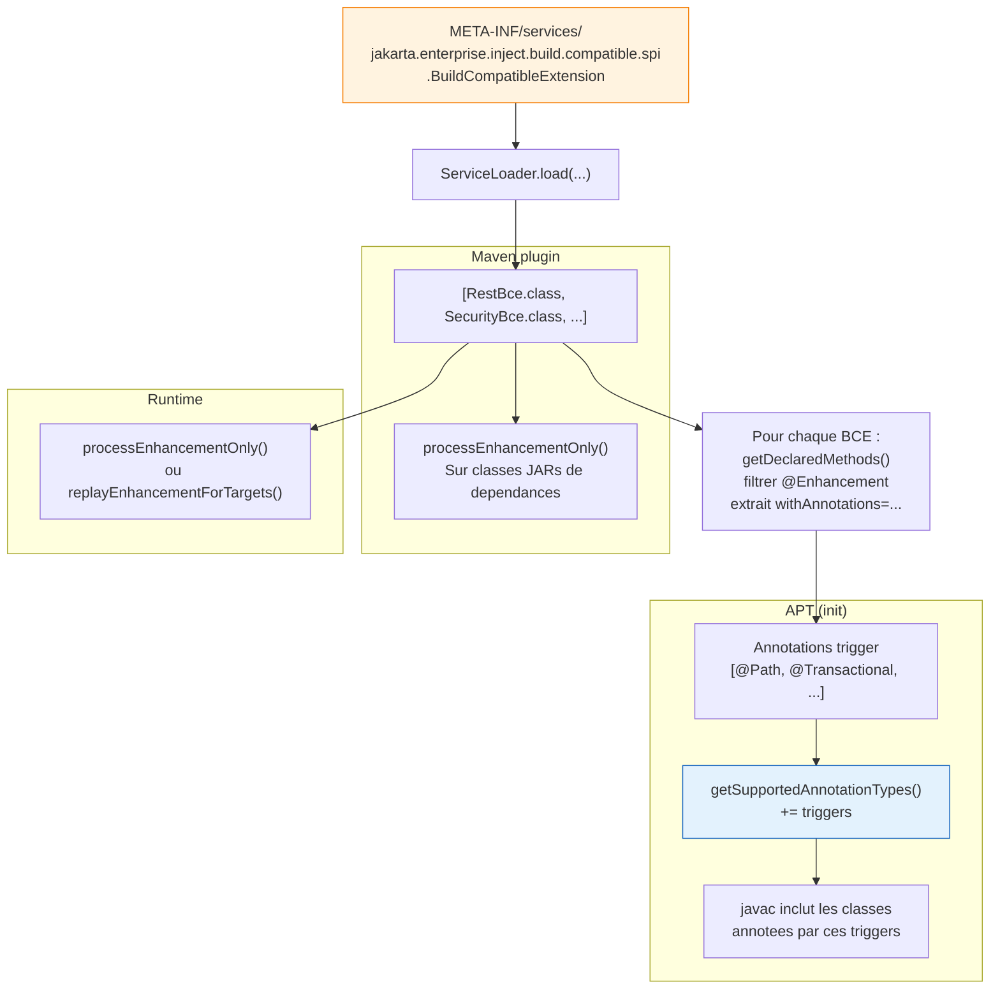

### Execution a trois niveaux

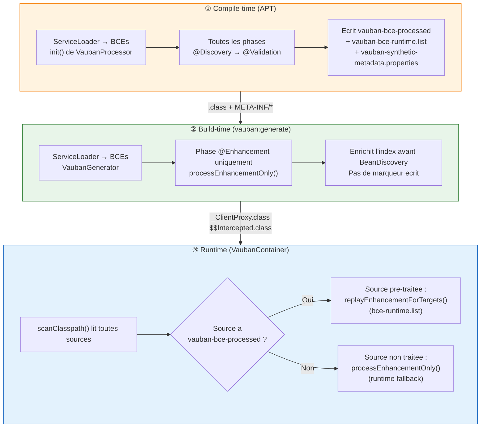

### Le fichier vauban-bce-runtime.list en detail

Ce fichier resout un probleme de coherence : l'APT a determine quelles classes correspondent
aux filtres `@Enhancement`, mais le bytecode de ces classes **n'est pas reecrit** pour
encoder cette information. Au runtime, le conteneur doit pouvoir rejouer exactement les memes
associations (BCE, classe cible) sans refaire le matching.

Format (une paire par ligne) :
```
# Vauban BCE runtime replay list — generated at compile time by APT
com.example.RestBce;com.example.HelloResource
com.example.RestBce;com.example.UserResource
com.example.SecurityBce;com.example.AdminResource
```

Chargement runtime :
```
META-INF/vauban-bce-runtime.list
  ligne : "bceFqn;targetFqn"
  → Class.forName(bceFqn), Class.forName(targetFqn)
  → BceProcessor.replayEnhancementForTargets(pairs, index)
```

`replayEnhancementForTargets()` bypass tout le matching de types/annotations : les paires
sont invoquees directement. Performance constante, O(n) en nombre de paires.

---

## Generation de code (Class-File API JDK 25)

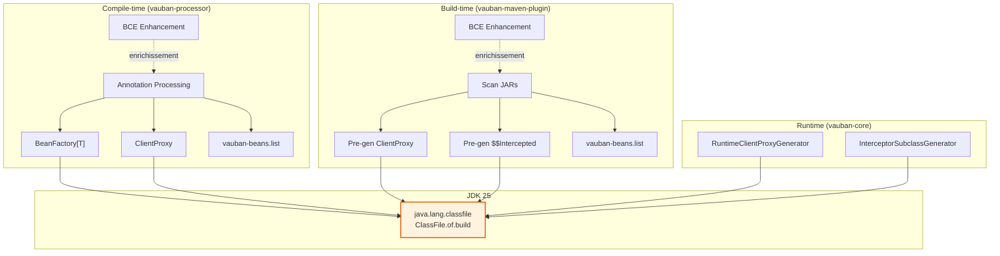

**Trois niveaux de generation :**

1. **Compile-time** (`vauban-processor`) : APT genere factories, proxies et `vauban-beans.list` pour les beans du module courant
2. **Build-time** (`vauban-maven-plugin`) : pre-genere proxies et intercepteurs pour les beans des JARs de dependances
3. **Runtime** (`vauban-core`) : genere a la volee si pas pre-genere (fallback)

Tous utilisent `java.lang.classfile.ClassFile` — **zero dependance bytecode externe** (pas d'ASM, pas de ByteBuddy).

Les classes generees ont des noms deterministes :

| Type | Naming | Exemple |
|------|--------|---------|
| Factory | `<BeanClass>_Factory` | `com.example.MyService_Factory` |
| Client proxy | `<BeanClass>_ClientProxy` | `com.example.MyService_ClientProxy` |
| Sous-classe interceptee | `<BeanClass>$$Intercepted` | `com.example.MyService$$Intercepted` |

---

## Fichiers META-INF generes par Vauban

| Fichier | Genere par | Moment | Contenu | Lu par |
|---------|-----------|--------|---------|--------|
| `META-INF/vauban-beans.list` | APT + Maven plugin | compile / process-classes | Noms de classes CDI decouverts (tries, un par ligne), incluant les classes promues par BCE | `VaubanContainerBuilder.scanClasspath()` |
| `META-INF/vauban-bce-processed` | APT (si BCEs presentes) | compile | Marqueur texte : `# BCE phases executed at compile time` | `VaubanContainerBuilder` : skip BCE pour cette source |
| `META-INF/vauban-bce-runtime.list` | APT (si `@Enhancement` modifie des classes) | compile | Paires `bceFqn;targetFqn` : associations BCE→classe decidees a la compilation | `VaubanContainerBuilder` : rejoue exactement ces paires via `replayEnhancementForTargets()` |
| `META-INF/vauban-synthetic-metadata.properties` | APT (si `@Synthesis`) | compile | Beans synthetiques et observers synthetiques serialises | `VaubanContainerBuilder.build()` : re-cree les beans/observers sans relancer BCE |

### Semantique per-source

Chaque fichier est **par JAR** (ou repertoire de classes). Un JAR de dependance peut avoir
`vauban-bce-processed` (APT a tourne sur ce module) pendant que le projet applicatif ne l'a pas
(pas d'APT configure). Le conteneur traite chaque source independamment :

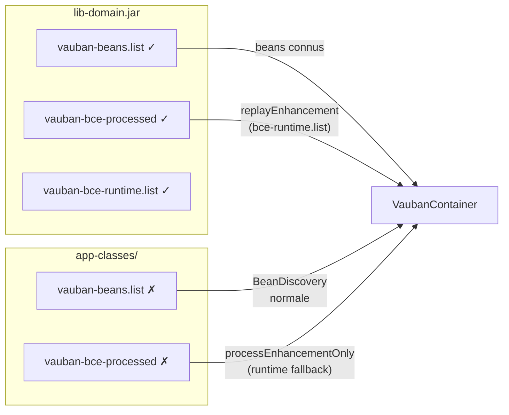

### Regles d'idempotence

- `vauban-beans.list` : `VaubanGenerator` collecte d'abord les listes existantes (`alreadyKnownBeans`), ne rescanne pas les sources qui en ont deja une.
- `_ClientProxy.class` / `$$Intercepted.class` : `VaubanGenerator` verifie l'existence sur disque avant de generer (idempotent).
- `vauban-bce-processed` : presence = toutes les phases BCE ont ete executees a la compilation. Absence = les phases BCE doivent etre (partiellement) rejouees au runtime.
