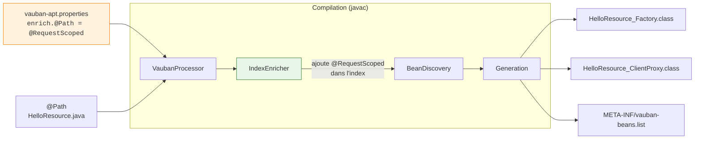
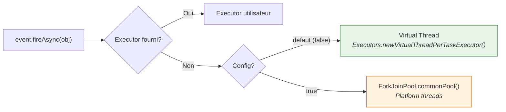

# Configuration Vauban

Vauban se configure via des **proprietes systeme** (`-D...`) ou des **variables d'environnement**.
La propriete systeme prend toujours priorite sur la variable d'environnement equivalente.

## Reference des proprietes

| Propriete systeme | Variable d'environnement | Defaut | Description |
|---|---|---|---|
| `VaubanUsePlatformThreadsForAsyncEvents` | `VAUBAN_USE_PLATFORM_THREADS_FOR_ASYNC_EVENTS` | `false` | Si `true`, les evenements asynchrones (`fireAsync`) utilisent le `ForkJoinPool.commonPool()` (platform threads) au lieu de virtual threads. |

---

## Enrichissement de beans : `vauban-apt.properties`

> **Alternative zero-code aux Build Compatible Extensions.**
> Depuis que Vauban execute les BCEs a la compilation, le meme resultat peut etre
> obtenu avec une BCE `@Enhancement`. `vauban-apt.properties` reste utile quand on
> veut un enrichissement **sans ecrire de code Java** — une seule ligne de config
> suffit. Pour des cas plus complexes (qualifier, interceptor binding, synthese),
> utiliser une BCE.

| Approche | Avantage | Limite |
|----------|---------|-------|
| `vauban-apt.properties` | Zero-code, une ligne par regle | Scope uniquement |
| BCE `@Enhancement` | Standard CDI, toute modification possible | Necessite une classe Java |

Vauban permet de promouvoir des classes non-CDI en beans CDI a la compilation,
sans ecrire de Build Compatible Extension. Le fichier `vauban-apt.properties`
dans `src/main/resources/` definit des regles d'enrichissement.

### Format

```properties
# Chaque regle associe une annotation declencheur a un scope CDI
# Format : enrich.<annotation-fqcn>=<scope-fqcn>
enrich.jakarta.ws.rs.Path=jakarta.enterprise.context.RequestScoped
enrich.jakarta.ws.rs.ext.Provider=jakarta.enterprise.context.ApplicationScoped
enrich.jakarta.websocket.server.ServerEndpoint=jakarta.enterprise.context.Dependent
```

**Cle** : `enrich.` + nom complet de l'annotation declencheur  
**Valeur** : nom complet du scope CDI a appliquer

### Fonctionnement



1. **APT** (`VaubanProcessor`) lit `vauban-apt.properties` depuis `target/classes`
2. Les annotations trigger (ex: `@Path`) sont ajoutees aux `@SupportedAnnotationTypes`
3. `IndexEnricher` ajoute le scope synthetique au `ClassInfo` dans l'index
4. `BeanDiscovery` voit la classe comme un bean CDI standard
5. Les factories, proxies et `vauban-beans.list` sont generes normalement

### Regles

- Une classe **deja annotee** avec un scope CDI (`@ApplicationScoped`, `@RequestScoped`, etc.)
  n'est **pas modifiee** — le scope explicite a toujours priorite.
- L'annotation trigger (ex: `@Path`) doit etre presente sur le **classpath de compilation**.
  Vauban n'a pas besoin de dependre de JAX-RS ; c'est le projet utilisateur qui apporte la dependance.
- Si plusieurs regles matchent une meme classe, la **premiere regle** (ordre du fichier properties) gagne.
- Le fichier est **optionnel** : sans `vauban-apt.properties`, le comportement est identique a avant.

### Scopes supportes

| Scope | `isNormal` | Proxy genere ? |
|-------|-----------|----------------|
| `jakarta.enterprise.context.ApplicationScoped` | `true` | Oui |
| `jakarta.enterprise.context.RequestScoped` | `true` | Oui |
| `jakarta.enterprise.context.SessionScoped` | `true` | Oui |
| `jakarta.enterprise.context.Dependent` | `false` | Non |
| `jakarta.inject.Singleton` | `false` | Non |
| Scope custom | `true` (defaut) | Oui |

### Pipeline APT + Maven plugin

Le fichier `vauban-apt.properties` est lu par **les deux** :

| Phase | Outil | Traite |
|-------|-------|--------|
| Compilation (`javac`) | `VaubanProcessor` (APT) | Classes du module courant |
| Post-compilation (`process-classes`) | `VaubanGenerator` (Maven plugin) | JARs de dependances |

Le Maven plugin est intelligent : il **ne re-traite pas** les classes deja traitees par l'APT
(detection via `META-INF/vauban-beans.list` existant), et ne regenere pas les proxies deja sur disque.

### Exemple complet : JAX-RS avec CDI

**`src/main/resources/vauban-apt.properties`** :
```properties
enrich.jakarta.ws.rs.Path=jakarta.enterprise.context.RequestScoped
```

**`src/main/java/com/example/HelloResource.java`** :
```java
@Path("/hello")
public class HelloResource {

    @Inject
    GreetingService greetingService;

    @GET
    public String hello() {
        return greetingService.greet();
    }
}
```

Sans `vauban-apt.properties`, cette classe n'est pas un bean CDI (pas de scope).
Avec la regle d'enrichissement, elle recoit automatiquement `@RequestScoped` a la compilation
et devient un bean CDI injectable avec proxy — sans BCE, sans `RestScopeExtension`.

---

## Details

### Async Events : threading model

Par defaut, `Event.fireAsync()` execute les observers asynchrones sur des **virtual threads**
via `Executors.newVirtualThreadPerTaskExecutor()`. Chaque notification d'evenement cree un
virtual thread dedie, leger et non bloquant pour le scheduler OS.



**Priorite de l'executor :**

1. `NotificationOptions.ofExecutor(myExecutor)` — toujours prioritaire
2. `Executors.newVirtualThreadPerTaskExecutor()` — defaut
3. `ForkJoinPool.commonPool()` — si `VaubanUsePlatformThreadsForAsyncEvents=true`

#### Utilisation

```bash
# Virtual threads (defaut, rien a faire)
java -jar mon-app.jar

# Forcer les platform threads
java -DVaubanUsePlatformThreadsForAsyncEvents=true -jar mon-app.jar

# Via variable d'environnement
export VAUBAN_USE_PLATFORM_THREADS_FOR_ASYNC_EVENTS=true
java -jar mon-app.jar

# Executor custom par evenement (toujours possible)
event.fireAsync(obj, NotificationOptions.ofExecutor(myExecutor));
```

#### Quand utiliser les platform threads ?

Les platform threads peuvent etre preferes dans certains cas :

- **Debugging** : les virtual threads ont des stack traces differentes
- **Compatibilite** : bibliotheques utilisant `ThreadLocal` (non compatible virtual threads)
- **Controle du parallelisme** : le `ForkJoinPool` a une taille fixe, les virtual threads non

Dans la majorite des cas, les virtual threads sont le meilleur choix.
