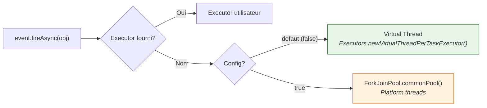

# Configuration Vauban

Vauban se configure via des **proprietes systeme** (`-D...`) ou des **variables d'environnement**.
La propriete systeme prend toujours priorite sur la variable d'environnement equivalente.

## Reference des proprietes

| Propriete systeme | Variable d'environnement | Defaut | Description |
|---|---|---|---|
| `VaubanUsePlatformThreadsForAsyncEvents` | `VAUBAN_USE_PLATFORM_THREADS_FOR_ASYNC_EVENTS` | `false` | Si `true`, les evenements asynchrones (`fireAsync`) utilisent le `ForkJoinPool.commonPool()` (platform threads) au lieu de virtual threads. |

## Details

### Async Events : threading model

Par defaut, `Event.fireAsync()` execute les observers asynchrones sur des **virtual threads**
via `Executors.newVirtualThreadPerTaskExecutor()`. Chaque notification d'evenement cree un
virtual thread dedie, leger et non bloquant pour le scheduler OS.



**Priorite de l'executor :**

1. `NotificationOptions.ofExecutor(myExecutor)` — toujours prioritaire
2. `Executors.newVirtualThreadPerTaskExecutor()` — defaut
3. `ForkJoinPool.commonPool()` — si `VaubanUsePlatformThreadsForAsyncEvents=true`

#### Utilisation

```bash
# Virtual threads (defaut, rien a faire)
java -jar mon-app.jar

# Forcer les platform threads
java -DVaubanUsePlatformThreadsForAsyncEvents=true -jar mon-app.jar

# Via variable d'environnement
export VAUBAN_USE_PLATFORM_THREADS_FOR_ASYNC_EVENTS=true
java -jar mon-app.jar

# Executor custom par evenement (toujours possible)
event.fireAsync(obj, NotificationOptions.ofExecutor(myExecutor));
```

#### Quand utiliser les platform threads ?

Les platform threads peuvent etre preferes dans certains cas :

- **Debugging** : les virtual threads ont des stack traces differentes
- **Compatibilite** : bibliotheques utilisant `ThreadLocal` (non compatible virtual threads)
- **Controle du parallelisme** : le `ForkJoinPool` a une taille fixe, les virtual threads non

Dans la majorite des cas, les virtual threads sont le meilleur choix.
